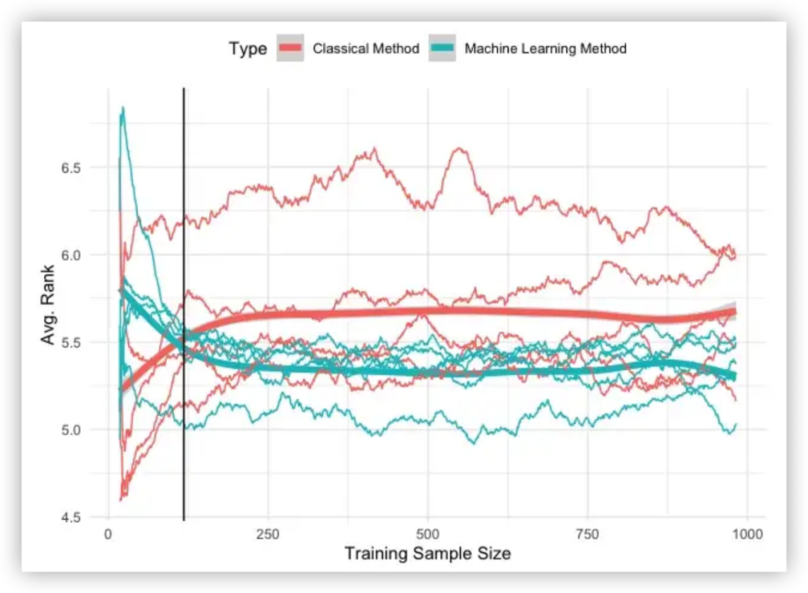
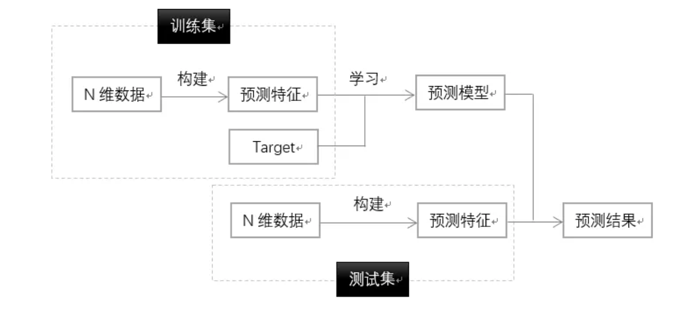

目录

- [为什么时间序列预测很难](#为什么时间序列预测很难)
  - [时间序列预测很难](#时间序列预测很难)
  - [样本量与模型精度](#样本量与模型精度)
- [传统时序预测方法的问题](#传统时序预测方法的问题)
- [时间序列数据预测方式](#时间序列数据预测方式)
- [时间序列数据变换方式](#时间序列数据变换方式)
- [时间序列数据集处理方式](#时间序列数据集处理方式)
  - [截面数据](#截面数据)
  - [时间序列数据](#时间序列数据)
- [参考](#参考)

# 为什么时间序列预测很难

机器学习和深度学习已越来越多应用在时序预测中。ARIMA 或指数平滑等经典预测方法正在被 XGBoost、
高斯过程或深度学习等机器学习回归算法所取代。

尽管时序模型越来越复杂，但人们对时序模型的性能表示怀疑。
有研究表明，复杂的时序模型并不一定会比时序分解模型有效。

时间序列是按时间排序的值，但时序预测具有很大的挑战性。从模型难度和精度角度考虑，
时序模型的确比常规的回归和分类任务更难。

## 时间序列预测很难

**原因 1：序列是非平稳的**

* 平稳性是时间序列的核心概念，如果时间序列的趋势（例如平均水平）不随时间变化，则该时间序列是平稳的。
  许多现有方法都假设时间序列是平稳的，但是趋势或季节性会打破平稳性。

**原因 2：依赖外部数据**

* 除了时间因素之外，时间序列通常还有额外的依赖性。时空数据是一个常见的例子，每个观察值都在两个维度上相关，
  因此数据具有自身的滞后（时间依赖性）和附近位置的滞后（空间依赖性）。

**原因 3：噪音和缺失值**

* 现实世界受到噪音和缺失值的困扰，设备故障可能会产生噪音和缺失值。
  传感器故障导致数据丢失，或者存在干扰，都会带来数据噪音。

**原因 4：样本量有限**

* 时间序列往往都只包含少量的观察值，可能没有足够的数据来构建足够的模型。
  数据采集的频率影响了样本量，同时也会遇到数据冷启动问题。

## 样本量与模型精度

时序模型往往无法进行完美预测，这可能和时序数据的样本量相关。在使用较大的训练集时，
具有大量参数的模型往往比参数较少的模型表现更好。在时序序列长度小于 1000 时，
深度模型往往并不会比时序分类模型更好。

下面对比了模型精度与样本个数的关系，这里尝试了五种经典方法（ARIMA、ETS、TBATS、Theta 和 Naive）、
五种机器学习方法（高斯过程、M5、LASSO、随机森林和 MARS）。预测任务是来预测时间序列的下一个值。
结果如下图所示，轴表示训练样本大小，即用于拟合预测模型的数据量。
轴表示所有时间序列中每个模型的平均误差，使用交叉验证计算得出。

当只有少数观测值可用时，基础方法表现出更好的性能。
然而，随着样本量的增加，机器学习方法优于经典方法。

进一步可以得出以下结论：

* 机器学习方法拥有很强的预测能力，前提是它们具有足够大的训练数据集；
* 当只有少量观测值可用时，推荐首选 ARIMA 或指数平滑等经典方法；
* 可以将指数平滑等经典方法与机器学习相结合可以提高预测准确性。

# 传统时序预测方法的问题

做时间序列预测，传统模型最简便，比如 Exponential Smoothing 和 ARIMA。
但这些模型一次只能对一组时间序列做预测，比如预测某个品牌下某家店的未来销售额。
而现实中需要面对的任务更多是：预测某个品牌下每家店的未来销售额。
也就是说，如果这个品牌在某个地区一共有 100 家店，那我们就需要给出这 100 家店分别对应的销售额预测值。
这个时候如果再用传统模型，显然不合适，毕竟有多少家店就要建多少个模型。

另外，在大数据时代，面对的数据往往都是高维的，如果仅使用这些传统方法，很多额外的有用信息可能会错过。
所以，如果能用机器学习算法对这 “100 家店” 一起建模，那么整个预测过程就会高效很多。

综上，传统时序预测方法存在一下几个问题：

1. 对于时序本身有一些性质上的要求，需要结合预处理来做拟合，不是端到端的优化；
2. 需要对每条序列做拟合预测，性能开销大，数据利用率和泛化能力堪忧，无法做模型复用；
3. 较难引入外部变量，例如影响销量的除了历史销量，还可能有价格，促销，业绩目标，天气等等；
4. 通常来说多步预测能力比较差。

正因为这些问题，实际项目中一般只会用传统方法来做一些 baseline，
主流的应用还是属于下面要介绍的机器学习方法。

# 时间序列数据预测方式

用机器学习算法做时间序列预测，处理的数据会变得很需要技巧。
对于普通的截面数据，在构建特征和分割数据（比如做 K-fold CV）的时候不需要考虑时间窗口。
而对于时间序列，时间必须考虑在内，否则模型基本无效。
因此在数据处理上，时间序列数据处理的复杂度比截面数据要大。

对于时间序列数据来说，训练集即为历史数据，测试集即为新数据。历史数据对应的时间均在时间分割点之前，
新数据对应的时间均在分割点之后。历史数据和新数据均包含 `$N$` 维信息（如某品牌每家店的地理位置、销售的商品信息等），
但前者比后者多一列数据：预测目标变量(Target/Label)，即要预测的对象(如销售额)。

基于给出的数据，预测任务是：根据已有数据，预测测试集的 Target（如，
根据某品牌每家店 2018 年以前的历史销售情况，预测每家店 2018 年 1 月份头 15 天的销售额）。

# 时间序列数据变换方式

机器学习方法处理时间序列问题的基本思路就是，把时间序列切分成一段**历史训练窗口**和**未来的预测窗口**，
对于预测窗口中的每一条样本，基于训练窗口的信息来构建特征，转化为一个表格类预测问题来求解。

> 单个时间序列数据变换：

> 带有协变量的时序数据变换：

> 模型预测：

# 时间序列数据集处理方式

在构建预测特征上，截面数据和时间序列数据遵循的逻辑截然不同。

## 截面数据

首先来看针对截面数据的数据处理思路：

对于截面数据来说，训练集数据和测试集数据在时间维度上没有区别，
二者唯一的区别是前者包含要预测的目标变量，而后者没有该目标变量

一般来说，在做完数据清洗之后，用 “N 维数据” 来分别给训练集、测试集构建预测特征，
然后用机器学习算法在训练集的预测特征和 Target 上训练模型，
最后通过训练出的模型和测试集的预测特征来计算预测结果（测试集的 Target）。
此外，为了给模型调优，一般还需要从训练集里面随机分割一部分出来做验证集

## 时间序列数据

时间序列的处理思路则有所不同，时间序列预测的核心思想是：用过去时间里的数据预测未来时间里的 Target：

所以，在构建模型的时候，首先，将所有过去时间里的数据，
即训练集里的 N 维数据和 Target 都应该拿来构建预测特征。
而新数据本身的 N 维数据也应该拿来构建预测特征。
前者是历史特征（对应图上的预测特征 A），后者是未来特征（对应图上的预测特征 B），
二者合起来构成总预测特征集合。最后，用预测模型和这个总的预测特征集合来预测未来 Target。

看到这里，一个问题就产生了：既然所有的数据都拿来构建预测特征了，那预测模型从哪里来？
没有 Target 数据，模型该怎么构建？

你可能会说，那就去找 Target 呗。对，没有错。但这里需要注意，
我们要找的不是未来时间下的 Target（毕竟未来的事还没发生，根本无从找起），
而是从过去时间里构造 “未来的” Target，从而完成模型的构建。
这是在处理时间序列上，逻辑最绕的地方。

# 参考

* [为什么时序预测很难](https://mp.weixin.qq.com/s/K0VVbZBcFJB5ctKWeMHUgQ)
