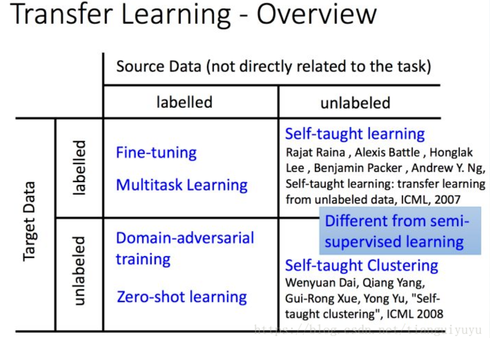

目录

- [Pre-train](#pre-train)
- [Fine-tuning](#fine-tuning)
  - [Fine-tuning 方法](#fine-tuning-方法)
- [为什么可以直接使用别人的模型](#为什么可以直接使用别人的模型)
- [参考](#参考)

# Pre-train

> pre-train(预训练)

Pretrain model 就是指之前被训练好的模型, 比如很大很耗时间的模型, 又不想从头训练一遍。
这时候可以直接下载别人训练好的模型，里面保存的都是每一层的参数配置情况。有了这样的模型之后，
可以直接拿来做测试, 前提是输出的类别是一样的

# Fine-tuning

> fine -tuning(微调)

如果不一样咋办，但是恰巧你又有一小部分的图片可以留着做 Fine-tuning, 一般的做法是修改最后一层 softmax 层的 output 数量，
比如从 Imagenet 的 1000 类，降到只有 20 个类，那么自然最后的 InnerProducet 层，你需要重新训练，然后再经过 Softmax 层，
再训练的时候，可以把除了最后一层之外的所有层的 learning rate 设置成为 0， 这样在 traing 过程，他们的 parameter 就不会变，
而把最后一层的 learning rate 调的大一点，让他尽快收敛，也就是 Training Error 尽快等于 0

## Fine-tuning 方法

举个例子，假设今天老板给你一个新的数据集，让你做一下图片分类，这个数据集是关于 flower 的。
问题是，数据集中 flower 的类别很少，数据集中的数据也不多，你发现从零训练开始训练 CNN 的效果很差，
很容易过拟合。怎么办呢，于是你想到了使用 Transfer Learning，用别人已经训练好的 Imagenet 的模型来做

做的方法有很多：

* 把 Alexnet 里卷积层最后一层输出的特征拿出来，然后直接用 SVM 分类。
  这是 Transfer Learning，因为你用到了 Alexnet 中已经学到了的“知识”
* 把 Vggnet 卷积层最后的输出拿出来，用贝叶斯分类器分类。思想基本同上
* 甚至你可以把 Alexnet、Vggnet 的输出拿出来进行组合，自己设计一个分类器分类。
  这个过程中你不仅用了 Alexnet 的“知识”，也用了 Vggnet 的“知识”
* 最后，你也可以直接使用 fine-tuning 这种方法，在 Alexnet 的基础上，重新加上全连接层，再去训练网络

综上，Transfer Learning 关心的问题是：什么是“知识”以及如何更好地运用之前得到的“知识”。
这可以有很多方法和手段。而 fine-tuning 只是其中的一种手段

简单来说 Transfer learning 可以看成是一套完整的体系，是一种处理流程。
目的是为了不抛弃从之前数据里得到的有用信息，也是为了应对新进来的大量数据的缺少标签或者由于数据更新而导致的标签变异情况。
至于说 Fine-tuning，在深度学习里面，这仅仅是一个处理手段。之所以现在大量采用 fine-tuning，
是因为有很多人用实验证实了：单纯从自己的训练样本训练的模型，效果没有 fine-tuning 的好

学术界的风气本就如此，一个被大家证实的行之有效的方法会在短时间内大量被采用。
所以很多人在大数据下面先按照标准参数训练一个模型

# 为什么可以直接使用别人的模型

由于 ImageNet 数以百万计带标签的训练集数据，使得如 CaffeNet 之类的预训练的模型具有非常强大的泛化能力，
这些预训练的模型的中间层包含非常多一般性的视觉元素，我们只需要对他的后几层进行微调，在应用到我们的数据上，
通常就可以得到非常好的结果。最重要的是，在目标任务上达到很高 performance 所需要的数据的量相对很少

# 参考

* [关于Pretrain、Fine-tuning](https://www.cnblogs.com/jiading/p/11995883.html)
