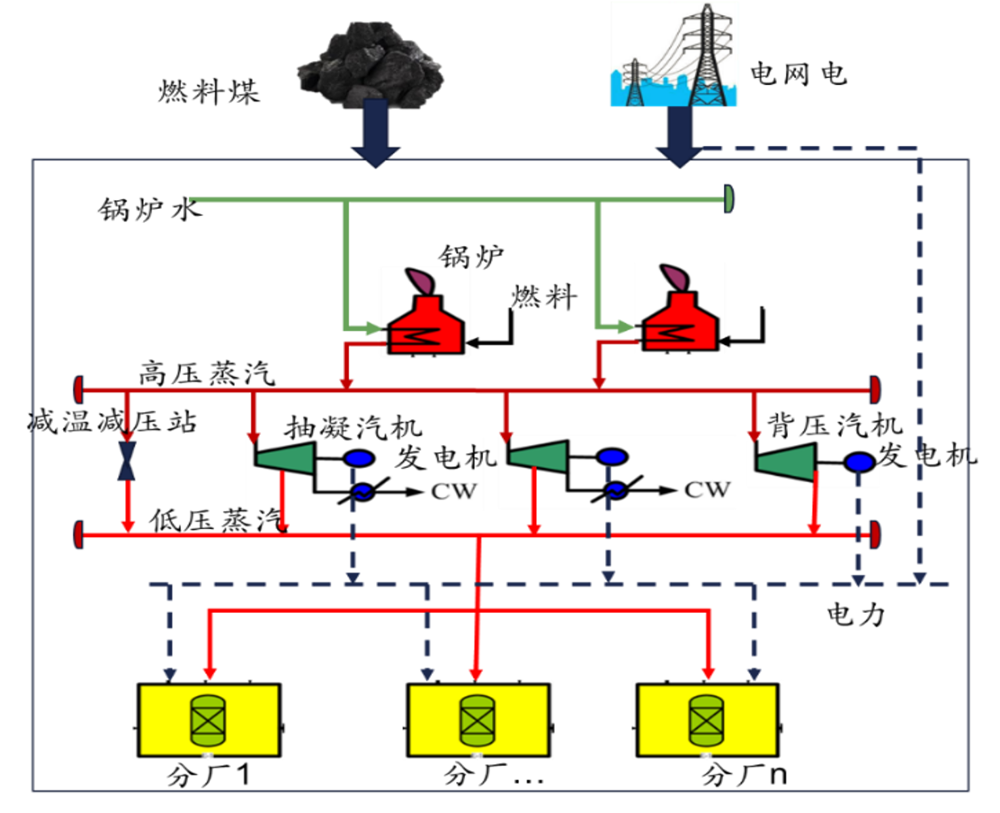

# 前言(千言万语道不尽)

- TODO

# 热电联产小科普

### 热电厂(热力发电厂)

热电联产的维基百科介绍是这样(因为介绍得比我专业得多，所以直接抄作业了)：

> 热力发电厂（英语：thermal power station 或 thermal power plant），简称热电厂，是由蒸汽作原动力的发电厂。水被加热，转变为蒸汽，推动蒸汽轮机运转，带动发电机工作，同时也做一些其他工作（如船舶推进）。当蒸汽通过轮机时，它被冷凝器冷凝，被加热它的场所回收，称为郎肯循环。
> 
> 核电站和大部分火力发电厂（即燃烧化石燃料的发电厂）都是热电厂，全球大部分的电力都是来自这两种电厂。另外地热、生物质能以及小部分太阳能发电站也是热电厂。
> 
> 另外有些时候热电厂一词指热电联产的电厂。

- 热电厂结构

### 热电联产

热电联产的维基百科介绍是这样的(抄作业)：

> 热电联产（又称汽电共生，英语：Cogeneration, combined heat and power，缩写：CHP），是利用热机或发电站同时产生电力和有用的热量。三重热电联产（Trigeneration）或冷却，热和电力联产（CCHP）"是指从燃料燃烧或太阳能集热器中同时产生电和有用的热量和冷却。
> 
> 热电联产是燃料的热力学有效使用。 在单独的电力生产中，一些能量必须作为废热被丢弃，但是在热电联产中，这些热能中的一些被投入使用。所有热电厂在发电期间排放的热量，可以通过冷却塔，烟道气或通过其它方式释放到自然环境中。相反，热电联产捕获一些或全部用于加热的副产物，或者非常接近于工厂，或者特别是在斯堪的纳维亚和东欧，作为用于生活区域加热的热水，温度范围为约80至130℃。这也称为“热电联产区域供热”（combined heat and power district heating, 缩写CHPDH）。小型热电联产厂是分散式发电的一个例子[2]。在中等温度（100-180℃，212-356°F）下的副产物热量也可以用于吸附式制冷机中以进行冷却。
> 
> 热电联产为一种工业制程技巧，利用发电后的废热用于工业制造或是利用工业制造的废热发电，达到能量最大化利用的目的。以先发电式来说由于传统发电机效率只有30%左右，高达70%燃料能量被转化成无用的热，汽电共生能再利用30%的热能于工业，使燃料达到60%效率。系统使用了各种工业机具原本就会在运作中所产生的废热，等于所发的电都是额外的收益。

我理解的热电联产 :smile: :

# 热电联产为什么这么难做？

- 热电厂供应能源的下游生产车间低压蒸汽、电力使用量预测
- 汽机性能曲线
- 汽机、锅炉能源成本优化模型
- 策略消息

# 工业互联网、数字孪生体

## 工业互联网

## 数字孪生体

# 参考资料

- [热电厂流程草图-维基百科](https://zh.wikipedia.org/wiki/%E7%83%AD%E5%8A%9B%E5%8F%91%E7%94%B5%E5%8E%82#/media/File:PowerStation3-zh.svg)