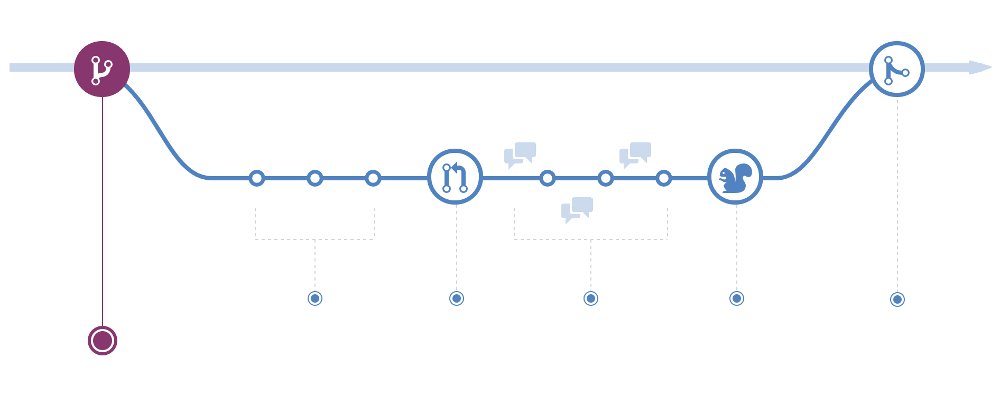
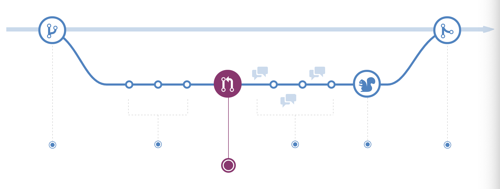
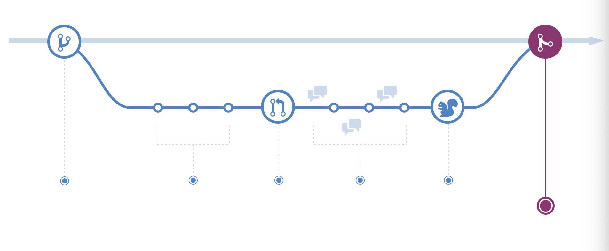

<!-- START doctoc generated TOC please keep comment here to allow auto update -->
<!-- DON'T EDIT THIS SECTION, INSTEAD RE-RUN doctoc TO UPDATE -->
**Table of Contents**  *generated with [DocToc](https://github.com/thlorenz/doctoc)*

- [Git flow](#git-flow)
  - [1.创建一个分支(create a branch)](#1%E5%88%9B%E5%BB%BA%E4%B8%80%E4%B8%AA%E5%88%86%E6%94%AFcreate-a-branch)
  - [2.添加提交(Add commit)](#2%E6%B7%BB%E5%8A%A0%E6%8F%90%E4%BA%A4add-commit)
  - [3.开一个拉取请求(Open a Pull Request)](#3%E5%BC%80%E4%B8%80%E4%B8%AA%E6%8B%89%E5%8F%96%E8%AF%B7%E6%B1%82open-a-pull-request)
  - [4.讨论和审核代码(Discuss and review your code)](#4%E8%AE%A8%E8%AE%BA%E5%92%8C%E5%AE%A1%E6%A0%B8%E4%BB%A3%E7%A0%81discuss-and-review-your-code)
  - [5.部署 (Deploy)](#5%E9%83%A8%E7%BD%B2-deploy)
  - [6.合并(Merge)](#6%E5%90%88%E5%B9%B6merge)
- [Git Repository 管理](#git-repository-%E7%AE%A1%E7%90%86)
  - [1.Git 下载 repo.zip 并关联到 GitHub remote](#1git-%E4%B8%8B%E8%BD%BD-repozip-%E5%B9%B6%E5%85%B3%E8%81%94%E5%88%B0-github-remote)
  - [2.Git http/https ⇒ SSH](#2git-httphttps-%E2%87%92-ssh)
- [Cloning with SSH URLs](#cloning-with-ssh-urls)
  - [1.Introductio](#1introductio)
  - [2.Connecting to GitHub with SSH](#2connecting-to-github-with-ssh)
    - [2.1 关于 SSH](#21-%E5%85%B3%E4%BA%8E-ssh)
    - [2.2 检查本地是否已有 SSH keys](#22-%E6%A3%80%E6%9F%A5%E6%9C%AC%E5%9C%B0%E6%98%AF%E5%90%A6%E5%B7%B2%E6%9C%89-ssh-keys)
    - [2.3 生成一个新的 SSH key 并把生成的 SSH key 加入 ssh-agent](#23-%E7%94%9F%E6%88%90%E4%B8%80%E4%B8%AA%E6%96%B0%E7%9A%84-ssh-key-%E5%B9%B6%E6%8A%8A%E7%94%9F%E6%88%90%E7%9A%84-ssh-key-%E5%8A%A0%E5%85%A5-ssh-agent)
    - [2.4 将 SSH key 加入 GitHub 账号](#24-%E5%B0%86-ssh-key-%E5%8A%A0%E5%85%A5-github-%E8%B4%A6%E5%8F%B7)
    - [2.5 测试 SSH 连接](#25-%E6%B5%8B%E8%AF%95-ssh-%E8%BF%9E%E6%8E%A5)
    - [2.6 使用 SSH passphrases 工作](#26-%E4%BD%BF%E7%94%A8-ssh-passphrases-%E5%B7%A5%E4%BD%9C)
- [Git 基础知识](#git-%E5%9F%BA%E7%A1%80%E7%9F%A5%E8%AF%86)
  - [1.安装 Git(Mac)](#1%E5%AE%89%E8%A3%85-gitmac)
  - [2.创建 SSH Key](#2%E5%88%9B%E5%BB%BA-ssh-key)
  - [3.Git 配置](#3git-%E9%85%8D%E7%BD%AE)
    - [3.1 配置 Git](#31-%E9%85%8D%E7%BD%AE-git)
    - [3.2 Git 配置文件](#32-git-%E9%85%8D%E7%BD%AE%E6%96%87%E4%BB%B6)
    - [3.3 检查 Git 配置信息](#33-%E6%A3%80%E6%9F%A5-git-%E9%85%8D%E7%BD%AE%E4%BF%A1%E6%81%AF)
  - [4.获取帮助](#4%E8%8E%B7%E5%8F%96%E5%B8%AE%E5%8A%A9)
  - [5.Git 工作流程](#5git-%E5%B7%A5%E4%BD%9C%E6%B5%81%E7%A8%8B)
    - [5.1 创建 Git仓库(2种)](#51-%E5%88%9B%E5%BB%BA-git%E4%BB%93%E5%BA%932%E7%A7%8D)
    - [5.2 添加版本库中的文件到暂存区](#52-%E6%B7%BB%E5%8A%A0%E7%89%88%E6%9C%AC%E5%BA%93%E4%B8%AD%E7%9A%84%E6%96%87%E4%BB%B6%E5%88%B0%E6%9A%82%E5%AD%98%E5%8C%BA)
    - [5.3 把暂存区的所有内容提交到当前分支](#53-%E6%8A%8A%E6%9A%82%E5%AD%98%E5%8C%BA%E7%9A%84%E6%89%80%E6%9C%89%E5%86%85%E5%AE%B9%E6%8F%90%E4%BA%A4%E5%88%B0%E5%BD%93%E5%89%8D%E5%88%86%E6%94%AF)
    - [5.4 把一个已有的本地仓库和远程git库关联](#54-%E6%8A%8A%E4%B8%80%E4%B8%AA%E5%B7%B2%E6%9C%89%E7%9A%84%E6%9C%AC%E5%9C%B0%E4%BB%93%E5%BA%93%E5%92%8C%E8%BF%9C%E7%A8%8Bgit%E5%BA%93%E5%85%B3%E8%81%94)
    - [5.5 把本地库的内容推送到远程(把当前分支推送到远程)](#55-%E6%8A%8A%E6%9C%AC%E5%9C%B0%E5%BA%93%E7%9A%84%E5%86%85%E5%AE%B9%E6%8E%A8%E9%80%81%E5%88%B0%E8%BF%9C%E7%A8%8B%E6%8A%8A%E5%BD%93%E5%89%8D%E5%88%86%E6%94%AF%E6%8E%A8%E9%80%81%E5%88%B0%E8%BF%9C%E7%A8%8B)
    - [5.6 从远程分支拉取最新的版本到本地并合并](#56-%E4%BB%8E%E8%BF%9C%E7%A8%8B%E5%88%86%E6%94%AF%E6%8B%89%E5%8F%96%E6%9C%80%E6%96%B0%E7%9A%84%E7%89%88%E6%9C%AC%E5%88%B0%E6%9C%AC%E5%9C%B0%E5%B9%B6%E5%90%88%E5%B9%B6)
  - [6.查看当前信息](#6%E6%9F%A5%E7%9C%8B%E5%BD%93%E5%89%8D%E4%BF%A1%E6%81%AF)
    - [6.1 查看当前文件状态](#61-%E6%9F%A5%E7%9C%8B%E5%BD%93%E5%89%8D%E6%96%87%E4%BB%B6%E7%8A%B6%E6%80%81)
    - [6.2 查看已暂存和未暂存的修改](#62-%E6%9F%A5%E7%9C%8B%E5%B7%B2%E6%9A%82%E5%AD%98%E5%92%8C%E6%9C%AA%E6%9A%82%E5%AD%98%E7%9A%84%E4%BF%AE%E6%94%B9)
    - [6.3 查看工作区和版本库里最新版本的区别](#63-%E6%9F%A5%E7%9C%8B%E5%B7%A5%E4%BD%9C%E5%8C%BA%E5%92%8C%E7%89%88%E6%9C%AC%E5%BA%93%E9%87%8C%E6%9C%80%E6%96%B0%E7%89%88%E6%9C%AC%E7%9A%84%E5%8C%BA%E5%88%AB)
  - [7.移除文件(从暂存区域移除)](#7%E7%A7%BB%E9%99%A4%E6%96%87%E4%BB%B6%E4%BB%8E%E6%9A%82%E5%AD%98%E5%8C%BA%E5%9F%9F%E7%A7%BB%E9%99%A4)
    - [7.1 确定要从版本库中删除文件](#71-%E7%A1%AE%E5%AE%9A%E8%A6%81%E4%BB%8E%E7%89%88%E6%9C%AC%E5%BA%93%E4%B8%AD%E5%88%A0%E9%99%A4%E6%96%87%E4%BB%B6)
    - [7.2 误删工作区文件, 将版本库中的文件替换工作取得文件](#72-%E8%AF%AF%E5%88%A0%E5%B7%A5%E4%BD%9C%E5%8C%BA%E6%96%87%E4%BB%B6-%E5%B0%86%E7%89%88%E6%9C%AC%E5%BA%93%E4%B8%AD%E7%9A%84%E6%96%87%E4%BB%B6%E6%9B%BF%E6%8D%A2%E5%B7%A5%E4%BD%9C%E5%8F%96%E5%BE%97%E6%96%87%E4%BB%B6)
  - [8.版本回退](#8%E7%89%88%E6%9C%AC%E5%9B%9E%E9%80%80)
    - [8.1 提交日志](#81-%E6%8F%90%E4%BA%A4%E6%97%A5%E5%BF%97)
    - [8.2 查看命令历史, 记录每次命令](#82-%E6%9F%A5%E7%9C%8B%E5%91%BD%E4%BB%A4%E5%8E%86%E5%8F%B2-%E8%AE%B0%E5%BD%95%E6%AF%8F%E6%AC%A1%E5%91%BD%E4%BB%A4)
    - [8.3 版本回退](#83-%E7%89%88%E6%9C%AC%E5%9B%9E%E9%80%80)
      - [8.3.1 回退到上一个版本(HEAD: 当前版本)](#831-%E5%9B%9E%E9%80%80%E5%88%B0%E4%B8%8A%E4%B8%80%E4%B8%AA%E7%89%88%E6%9C%AChead-%E5%BD%93%E5%89%8D%E7%89%88%E6%9C%AC)
      - [8.3.2 前进到某个版本](#832-%E5%89%8D%E8%BF%9B%E5%88%B0%E6%9F%90%E4%B8%AA%E7%89%88%E6%9C%AC)
  - [9.撤销修改](#9%E6%92%A4%E9%94%80%E4%BF%AE%E6%94%B9)
    - [9.1 丢弃工作区的修改,](#91-%E4%B8%A2%E5%BC%83%E5%B7%A5%E4%BD%9C%E5%8C%BA%E7%9A%84%E4%BF%AE%E6%94%B9)
    - [9.2 把暂存区的修改回退到工作区(丢弃暂存区的修改)](#92-%E6%8A%8A%E6%9A%82%E5%AD%98%E5%8C%BA%E7%9A%84%E4%BF%AE%E6%94%B9%E5%9B%9E%E9%80%80%E5%88%B0%E5%B7%A5%E4%BD%9C%E5%8C%BA%E4%B8%A2%E5%BC%83%E6%9A%82%E5%AD%98%E5%8C%BA%E7%9A%84%E4%BF%AE%E6%94%B9)
  - [10.分支管理](#10%E5%88%86%E6%94%AF%E7%AE%A1%E7%90%86)
    - [10.1 创建与合并分支](#101-%E5%88%9B%E5%BB%BA%E4%B8%8E%E5%90%88%E5%B9%B6%E5%88%86%E6%94%AF)
      - [10.1.1 创建tinker分支, 然后切换到tinker分支](#1011-%E5%88%9B%E5%BB%BAtinker%E5%88%86%E6%94%AF-%E7%84%B6%E5%90%8E%E5%88%87%E6%8D%A2%E5%88%B0tinker%E5%88%86%E6%94%AF)
      - [10.1.2 查看当前分支](#1012-%E6%9F%A5%E7%9C%8B%E5%BD%93%E5%89%8D%E5%88%86%E6%94%AF)
      - [10.1.3 切换回master分支](#1013-%E5%88%87%E6%8D%A2%E5%9B%9Emaster%E5%88%86%E6%94%AF)
      - [10.1.4 将tinker分支的工作成果合并到master分支上](#1014-%E5%B0%86tinker%E5%88%86%E6%94%AF%E7%9A%84%E5%B7%A5%E4%BD%9C%E6%88%90%E6%9E%9C%E5%90%88%E5%B9%B6%E5%88%B0master%E5%88%86%E6%94%AF%E4%B8%8A)
      - [10.1.5 删除tinker分支](#1015-%E5%88%A0%E9%99%A4tinker%E5%88%86%E6%94%AF)
- [Git Pull Request](#git-pull-request)
  - [1.Fork](#1fork)
  - [2.Clone](#2clone)
  - [3.Branch](#3branch)
    - [3.1 确认分支](#31-%E7%A1%AE%E8%AE%A4%E5%88%86%E6%94%AF)
    - [3.2 创建特性(feature)分支](#32-%E5%88%9B%E5%BB%BA%E7%89%B9%E6%80%A7feature%E5%88%86%E6%94%AF)
  - [4.Change](#4change)
    - [4.1 修改项目代码](#41-%E4%BF%AE%E6%94%B9%E9%A1%B9%E7%9B%AE%E4%BB%A3%E7%A0%81)
    - [4.2 提交修改](#42-%E6%8F%90%E4%BA%A4%E4%BF%AE%E6%94%B9)
    - [4.3 创建远程分支](#43-%E5%88%9B%E5%BB%BA%E8%BF%9C%E7%A8%8B%E5%88%86%E6%94%AF)
  - [5.Pull Request](#5pull-request)
- [Git .gitignore 相关](#git-gitignore-%E7%9B%B8%E5%85%B3)
  - [1.设置 `.gitignore`](#1%E8%AE%BE%E7%BD%AE-gitignore)
  - [2.更新 `.gitignore`](#2%E6%9B%B4%E6%96%B0-gitignore)

<!-- END doctoc generated TOC please keep comment here to allow auto update -->


<style>
h1 {
  background-color: #2B90B6;
  background-image: linear-gradient(45deg, #4EC5D4 10%, #146b8c 20%);
  background-size: 100%;
  -webkit-background-clip: text;
  -moz-background-clip: text;
  -webkit-text-fill-color: transparent;
  -moz-text-fill-color: transparent;
}
h2 {
  background-color: #2B90B6;
  background-image: linear-gradient(45deg, #4EC5D4 10%, #146b8c 20%);
  background-size: 100%;
  -webkit-background-clip: text;
  -moz-background-clip: text;
  -webkit-text-fill-color: transparent;
  -moz-text-fill-color: transparent;
}
</style>

# Git flow

GitHub flow 是一个轻量级的、基于分支(branch)的工作流, 它支持定期进行部署的团队和项目. 

## 1.创建一个分支(create a branch)



- When you're working on a project, you're going to have a bunch of
    different features or ideas in progress at any given time – some of
    which are ready to go, and others which are not. Branching exists to
    help you manage this workflow.

- When you create a branch in your project, you're creating an
    environment where you can try out new ideas. Changes you make on a
    branch don't affect the `master` branch, so you're free to
    experiment and commit changes, safe in the knowledge that your branch
    won't be merged until it's ready to be reviewed by someone you're
    collaborating with.

- **ProTip**

    - Branching is a core concept in Git, and the entire GitHub flow is
        based upon it. There's only one rule: anything in the `master`
        branch is always deployable. Because of this, it's extremely
        important that your new branch is created off of master when
        working on a feature or a fix. Your branch name should be
        descriptive (e.g., `refactor-authentication`,
        `user-content-cache-key`, `make-retina-avatars`), so that
        others can see what is being worked on.

## 2.添加提交(Add commit)


- Once your branch has been created, it's time to start making changes.
    Whenever you add, edit, or delete a file, you're making a commit, and
    adding them to your branch. This process of adding commits keeps
    track of your progress as you work on a feature branch.

- Commits also create a transparent history of your work that others
    can follow to understand what you've done and why. Each commit has an
    associated commit message, which is a description explaining why a
    particular change was made. Furthermore, each commit is considered a
    separate unit of change. This lets you roll back changes if a bug is
    found, or if you decide to head in a different direction.

- **ProTip**

    - Commit messages are important, especially since Git tracks your
        changes and then displays them as commits once they're pushed to
        the server. By writing clear commit messages, you can make it
        easier for other people to follow along and provide feedback.

## 3.开一个拉取请求(Open a Pull Request)




- Pull Requests initiate discussion about your commits. Because they're
    tightly integrated with the underlying Git repository, anyone can see
    exactly what changes would be merged if they accept your request.

- You can open a Pull Request at any point during the development
    process: when you have little or no code but want to share some
    screenshots or general ideas, when you're stuck and need help or
    advice, or when you're ready for someone to review your work. By
    using GitHub's @mention system in your Pull Request message, you can
    ask for feedback from specific people or teams, whether they're down
    the hall or ten time zones away.

- **ProTip**

    - Pull Requests are useful for contributing to open source projects
        and for managing changes to shared repositories. If you're using a
        Fork & Pull Model, Pull Requests provide a way to notify project
        maintainers about the changes you'd like them to consider. If
        you're using a Shared Repository Model, Pull Requests help start
        code review and conversation about proposed changes before they're
        merged into the master branch.

## 4.讨论和审核代码(Discuss and review your code)


- Once a Pull Request has been opened, the person or team reviewing
    your changes may have questions or comments. Perhaps the coding style
    doesn't match project guidelines, the change is missing unit tests,
    or maybe everything looks great and props are in order. Pull Requests
    are designed to encourage and capture this type of conversation.

- You can also continue to push to your branch in light of discussion
    and feedback about your commits. If someone comments that you forgot
    to do something or if there is a bug in the code, you can fix it in
    your branch and push up the change. GitHub will show your new commits
    and any additional feedback you may receive in the unified Pull
    Request view.

- **ProTip**

    - Pull Request comments are written in Markdown, so you can embed
        images and emoji, use pre-formatted text blocks, and other
        lightweight formatting.

## 5.部署 (Deploy)


   
 - With GitHub, you can deploy from a branch for final testing in
    production before merging to master.
 - Once your pull request has been reviewed and the branch passes your
    tests, you can deploy your changes to verify them in production. If
    your branch causes issues, you can roll it back by deploying the
    existing master into production.

## 6.合并(Merge)



   

- Now that your changes have been verified in production, it is time to
  merge your code into the master branch.

- Once merged, Pull Requests preserve a record of the historical
  changes to your code. Because they're searchable, they let anyone go
  back in time to understand why and how a decision was made.

- **ProTip**

    - By incorporating certain keywords into the text of your Pull
    Request, you can associate issues with code. When your Pull
    Request is merged, the related issues are also closed. For
    example, entering the phrase `Closes #32` would close issue
    number 32 in the repository. For more information, check out our
    `help
    article <https://help.github.com/articles/closing-issues-via-commit-messages>`__.


# Git Repository 管理


## 1.Git 下载 repo.zip 并关联到 GitHub remote


1. 下载 repo.zip
2. 解压 repo.zip
3. 进入解压后的 repo

```bash
cd repo
```

4. 将 `repo` 关联到 GitHub remote

```bash
git init
git remote add origin <remote repository URL>
git remote -v
git pull origin master
```

## 2.Git http/https ⇒ SSH


1. 查看现在的仓库远程地址配置: 

```bash
git remote -v
```

2. 删除现在的远程地址配置: 

```bash
git remote rm origin
```

3. 添加新的远程地址配置: 

```bash
git remote add origin git@github.com:example.git
git remote set-url origin git@github.com:example.git
```

4. 现在可以使用SSH方式进行验证: 

```bash
git pull
...
# 第一次 git push 时需要执行以下操作
git push
git push --set-upstream origin master
```


# Cloning with SSH URLs


## 1.Introductio


- SSH URLs provides access to a Git repository via SSH, a secure
    protocol.
- To use these URLs, you must generate an `SSH keypair` on your
    computer and add the `public key` to your Github account.
- When you `git clone`, `git fetch`, `git pull`, `git push` to
    a remote repository using SSH URLs, you'll be prompted for a password
    and must provide your SSH key passphrase.
- If you are accessing an organization that uses SAML single sign-on
    (SSO), you must authorize your SSH key to access the organization
    before you authenticate.
- You can use an SSH URL to clone a repository to your computer, or as
    a secure way of deploying your code to production servers. You can
    also use SSH agent forwarding with your deploy script to avoid
    managing keys on the server.

## 2.Connecting to GitHub with SSH


### 2.1 关于 SSH


### 2.2 检查本地是否已有 SSH keys


在生成一个新的 SSH key 之前, 可以先检查一下本地是否已经有 SSH key.

```bash
$ ls -al /.ssh
```

### 2.3 生成一个新的 SSH key 并把生成的 SSH key 加入 ssh-agent


1. 生成一个新的 SSH key

```bash
$ ssh-keygen -t rsa -b 4096 -C "your_email@example.com"
```

2. 把生成的 SSH key 加入 ssh-agent

    - (1)Start the ssh-agent in the background

```bash
$ eval "$(ssh-agent -s)"
```

    - (2)[mac] modify your `/.ssh/config` file to automatically load keys
      into the ssh-agent and store passphrases in your keychain.

```bash
$ open /.ssh/config
$ touch /.ssh/config
$ vim /.ssh/config

Host alia_name
AddKeysTzoAgent yes
UseKeychain yes
IdentityFile /.ssh/id_rsa
```

    - (3)Add your SSH private key to the ssh-agent and store your passphrase in the keychain

```bash
# mac
$ ssh-add -K /.ssh/id_rsa

# Linux
$ ssh-add /.ssh/id_rsa
```

### 2.4 将 SSH key 加入 GitHub 账号


配置 GitHub 账号可以使用本地的 SSH key

1. 复制本地的 SSH key 公钥到剪切板上(clipboard)

```bash
pbcopy < /.ssh/id_rsa.pub
```

2. GitHub account
3. Settings
4. SSH and GPG keys
5. SSH keys
6. New SSH key
7. Title & Key
8. Add SSH key


### 2.5 测试 SSH 连接


### 2.6 使用 SSH passphrases 工作


# Git 基础知识


## 1.安装 Git(Mac)


```bash
$ sudo apt-get install git
$ git --version
```

## 2.创建 SSH Key


```bash
$ ssh-keygen -t rsa -p 4096 -C "your@email.com"
```

## 3.Git 配置


### 3.1 配置 Git


```bash
$ git config --global user.name "wangzhefeng"
$ git config --global user.email "wangzhefengr@163.com"
$ git config --global core.editor gedit
```

### 3.2 Git 配置文件


```bash
# 包含系统上每一个用户及它们仓库的通用配置
$ sudo gedit /etc/gitconfig

# 只针对当前用户
$ sudo gedit /.gitconfig
```

or:

```bash
$ sudo gedit /.config/git/config

# 针对该仓库
$ sudo gedit .git/config
```

### 3.3 检查 Git 配置信息


```bash
$ git config --list
$ git config user.name
$ git config user.email
$ git config core.editor
```

## 4.获取帮助


```bash
$ git help <verb>
$ git <verb> help
$ man git-<verb>

$ git help config
```

## 5.Git 工作流程


### 5.1 创建 Git仓库(2种)


1. 在现有项目或目录下导入所有的文件到Git中；

    - 建立本地仓库目录(项目目录)
    - 初始化版本库

        - 创建版本库(repository) => .git

            - 暂存区 => stage(index)
            - 唯一一个分支 => master
            - 指向master的一个指针 => HEAD

2. 新建远程库 => 从一个服务器克隆一个现有的Git仓库

- 方法一: 

```bash
$ mkdir git_test
$ git init
```

- 方法二: 

```bash
$ git clone https://github.com/wangzhefeng/git_test.git
$ git clone https://github.com/wangzhefeng/git_test.git git_test
```

### 5.2 添加版本库中的文件到暂存区


```bash
$ git .
# or
$ git add .
# or
$ git add file_name
# or
$ git add path_name\file_name
# or
$ git add path_name\*.txt
```

### 5.3 把暂存区的所有内容提交到当前分支


```bash
$ git commit -m 'initial project version'
```

### 5.4 把一个已有的本地仓库和远程git库关联


```bash
$ git remote add origin https://github.com/wangzhefeng/resp.git
```

### 5.5 把本地库的内容推送到远程(把当前分支推送到远程)


```bash
$ git push -u origin master
```

### 5.6 从远程分支拉取最新的版本到本地并合并


1. git fetch

    - 从远程获取最新版本到本地, 不会自动merge

2. git pull

    - 从远程获取最新版本到本地, 自动merge
    - 方法一: 

```bash
# 从远程的origin的master主分支下载最新的版本到origin/master分支上
$ git fetch origin master

# 比较本地的master分支和origin/master分支的差别
$ git log -p master..origin/master

# 合并
$ git merge origin/master
```

or

```bash
$ git fetch origin master:tmp
$ git diff tmp
$ git merge tmp
```

    - 方法二: 

```bash
$ git pull origin master
```

## 6.查看当前信息


### 6.1 查看当前文件状态


```bash
$ git status
$ git status -s
$ git status --short
```

### 6.2 查看已暂存和未暂存的修改


```bash
$ git diff 
$ git diff --cached
$ git diff --staged
```

### 6.3 查看工作区和版本库里最新版本的区别


```bash
$ git diff HEAD --file.txt
```

## 7.移除文件(从暂存区域移除)


### 7.1 确定要从版本库中删除文件


```bash
$ git rm
$ git commit -m "message"
```

or

```bash
$ git add .
```

### 7.2 误删工作区文件, 将版本库中的文件替换工作取得文件


```bash
$ git checkout -- test.txt
```

## 8.版本回退


### 8.1 提交日志


```bash
$ git log --pretty=oneline
```

### 8.2 查看命令历史, 记录每次命令


```bash
$ git reflog
```

### 8.3 版本回退


#### 8.3.1 回退到上一个版本(HEAD: 当前版本)


```bash
$ git log
$ git reset --hard HEAD^
$ git reset --hard HEAD10
$ git reset --hard commit_id
```

#### 8.3.2 前进到某个版本


```bash
$ git reflog
$ git reset --hard commit_id
```

## 9.撤销修改


### 9.1 丢弃工作区的修改, 


- 自修改后还未被放到暂存区(还未进行git add) => 回到和版本库一样的状态
- 添加到暂存区后又作了修改(进行了git add) => 添加到暂存区后的状态

```bash
$ git checkout -- file.txt
```

### 9.2 把暂存区的修改回退到工作区(丢弃暂存区的修改)


```bash
$ git reset HEAD file.txt
$ git checkout --file.txt
```

## 10.分支管理


### 10.1 创建与合并分支


#### 10.1.1 创建tinker分支, 然后切换到tinker分支


```bash
$ git checkout -b tinker
```

```bash
$ git branch tinker
$ git checkout tinker
```

#### 10.1.2 查看当前分支


```bash
$ git branch
```

#### 10.1.3 切换回master分支


```bash
git checkout master
```

#### 10.1.4 将tinker分支的工作成果合并到master分支上


```bash
$ git checkout master
$ git merge tinker
```

#### 10.1.5 删除tinker分支


```bash
$ git branch -d tinker
```


# Git Pull Request


pull request 是社会化编程的象征, 通过这个功能, 你可以参与到别人开发的项目中, 并作出自己的贡献. 
pull request 是自己修改源代码后, 请求对方仓库采纳的一种行为.

## 1.Fork


找到想要 `pull request` 的项目 `test` , 然后点击 `fork`
按钮, 此时自己的仓库中就会有一个别人的项目仓库, 名字为:  `you_github_name/test`\ . 

## 2.Clone


在把想要 `pull request` 的项目克隆到本地环境: 

```bash
git clone https://github.com/wangzhefeng/test.git
```

## 3.Branch


### 3.1 确认分支


通过在终端运行命令查看当前项目所在的分支, 通常都是在查看分支后再进行代码的修改, 这是个好习惯. 

```bash
git branch -a
```

### 3.2 创建特性(feature)分支


在应用 GitHub 修改代码时, 常常采用的策略是在主分支(`master`)下再创建一个特性分支(`feature_a`), 
在该特性分支下进行代码的修改, 然后通过该分支执行 `pull request` 操作. 
通过命令:  `git checkout -b feature_a master` (其中 `feature_a` 为新建的特性分支,  `master`
为当前所在的分支)创建新的特性分支并自动切换. 

```bash
git checkout -b feature_a master
```

## 4.Change


### 4.1 修改项目代码


在创建的 `feature_a`\ 分支下对 `fork`\ 的项目内容进行修改. 

### 4.2 提交修改

```bash
# 查看修改的内容是否正确
git diff

# 增加修改内容说明文档
git add README.md

# 提交修改
git commit -m "add README.md"
```

### 4.3 创建远程分支


要从 GitHub 发送 `pull request` , GitHub
端的仓库中必须有一个包含了修改后的代码的分支, 
所以需要创建一个与刚刚创建的特性分支（修改所在的分支）相对应的远程分支, 
执行命令: 

```bash
git push origin work1
```

其中:  `origin` 为当时 `fork` 的远程主分支的名称, 
一般默认为 `origin`, `feature_a` 为本地工作的特性分支.

然后进行查看是否创建成功: 

```bash
$ git branch -a
```

## 5.Pull Request


进入到自己的 GitHub 账户下, 并切换到创建的特性分支(`feature_a`)下, 
点击 `create pull request` , 确定没问题, 并填写相关修改内容, 
点击 `send pull request`.


# Git .gitignore 相关


## 1.设置 `.gitignore`


## 2.更新 `.gitignore`

Git 更新 ignore 文件直接修改 `.gitignore` 是不不会生效的, 需要先去掉已经托管的文件, 
修改完成之后再重新添加并提交.

1.删除已经托管的文件

```bash
$ git rm -r --cached path_to_file
```

1. 修改 `.gitignore` 文件的内容
2. 提交修改

```bash
$ git add .
$ git commit -m "clear cached"
$ git push
```