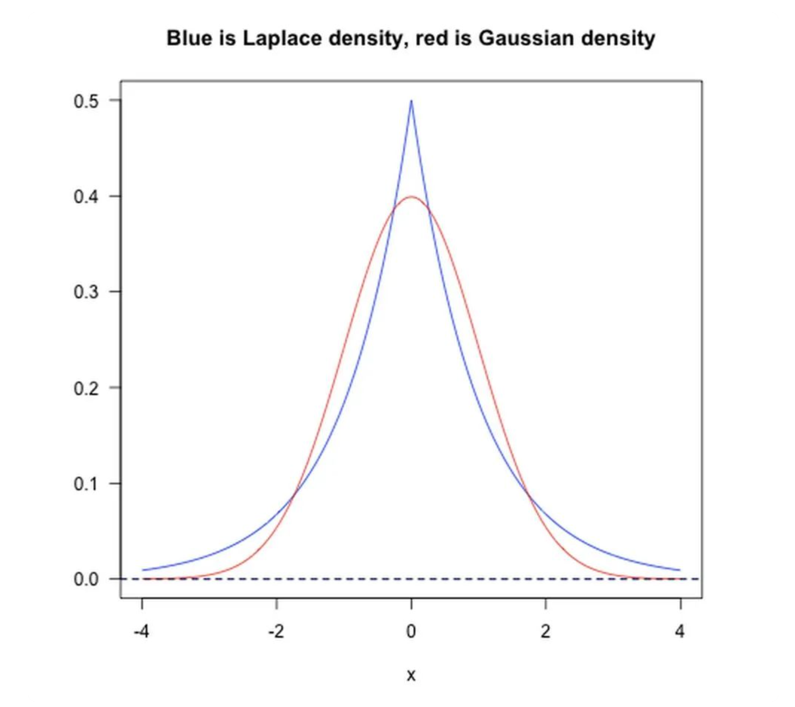
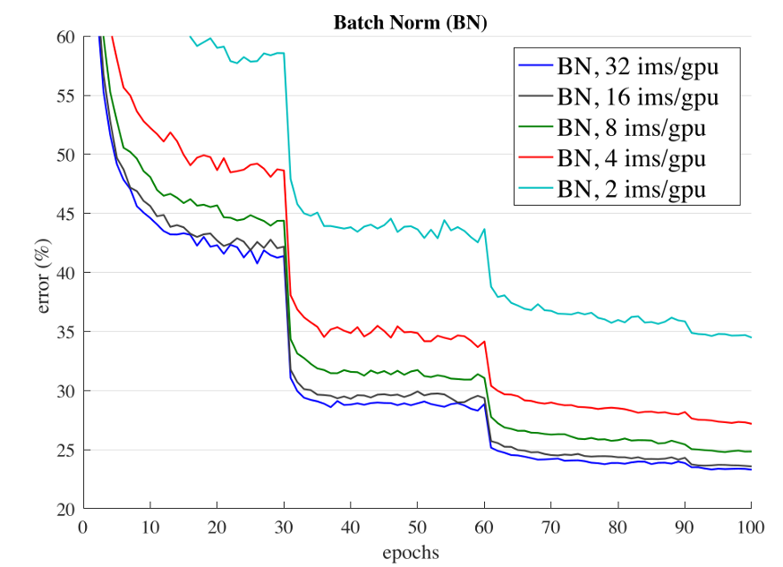
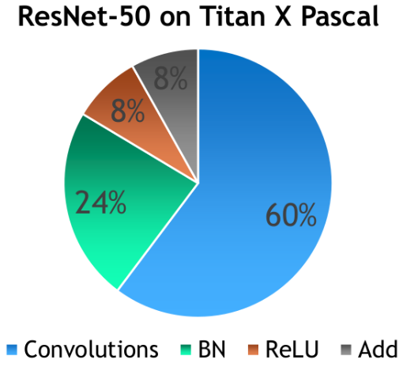

目录

- [过拟合](#过拟合)
  - [监督学习的目的](#监督学习的目的)
  - [模型过拟合](#模型过拟合)
  - [监督学习正则化](#监督学习正则化)
    - [监督机器学习的核心原理](#监督机器学习的核心原理)
    - [监督机器学习的核心问题](#监督机器学习的核心问题)
      - [经验风险项](#经验风险项)
      - [正则化项](#正则化项)
- [机器学习正则化](#机器学习正则化)
  - [范数](#范数)
  - [Lp 范数](#lp-范数)
  - [L0 范数](#l0-范数)
  - [L1 范数](#l1-范数)
    - [L1 范数定义](#l1-范数定义)
    - [L1 正则化](#l1-正则化)
  - [L2 范数](#l2-范数)
    - [L2 范数定义](#l2-范数定义)
    - [带 L2 正则化](#带-l2-正则化)
  - [L1 正则与 L2 正则的区别](#l1-正则与-l2-正则的区别)
    - [一般理解角度](#一般理解角度)
    - [贝叶斯先验角度](#贝叶斯先验角度)
- [神经网络正则化](#神经网络正则化)
  - [权值衰减](#权值衰减)
    - [L1 正则化](#l1-正则化-1)
    - [L2 正则化](#l2-正则化)
  - [Dropout](#dropout)
    - [Dropout 原理](#dropout-原理)
    - [Dropout 正则化效果解释](#dropout-正则化效果解释)
    - [Dropout 使用](#dropout-使用)
  - [数据增强](#数据增强)
  - [提前终止](#提前终止)
  - [Batch Normalization](#batch-normalization)
    - [归一化、标准化、正则化](#归一化标准化正则化)
      - [归一化(Normalization)](#归一化normalization)
      - [标准化(Standardization)](#标准化standardization)
      - [归一化和标准化的区别](#归一化和标准化的区别)
      - [为什么要归一化和标准化](#为什么要归一化和标准化)
    - [Batch Normalization 是什么？](#batch-normalization-是什么)
    - [Batch Normalization 原理](#batch-normalization-原理)
    - [Batch Normalization 的优点](#batch-normalization-的优点)
    - [Batch Normalization 的缺点](#batch-normalization-的缺点)
      - [Batch Normalization 在使用 batch size 的时候不稳定](#batch-normalization-在使用-batch-size-的时候不稳定)
      - [Batch Normalization 导致训练时间增加](#batch-normalization-导致训练时间增加)
      - [Batch Normalization 训练和推理时结果不一样](#batch-normalization-训练和推理时结果不一样)
      - [Batch Normalization 对于在线学习不友好](#batch-normalization-对于在线学习不友好)
      - [Batch Normalization 对循环神经网络不友好](#batch-normalization-对循环神经网络不友好)
    - [Batch Normalization 的可替代方法](#batch-normalization-的可替代方法)
- [Batch Normalization](#batch-normalization-1)
  - [Batch Normalization原理](#batch-normalization原理)
  - [Batch Normalization优点](#batch-normalization优点)

# 过拟合

## 监督学习的目的

监督机器学习的目的是为了让建立的模型能够发现数据中普遍的一般的规律, 
这个普遍的一般的规律无论对于训练集还是未知的测试集, 都具有较好的拟合能力。
假设空间中模型千千万, 当我们站在上帝视角, 
心里相信总会有个最好的模型可以拟合我们的训练数据, 
而且这个模型不会对训练集过度学习, 
它能够从训练集中尽可能的学到适用于所有潜在样本的“普遍规律”, 
不会将数据中噪声也学习了。这样的模型也就是我们想要的、能够有较低的泛化误差的模型

## 模型过拟合

- **过拟合含义:**
   - 过拟合是指在机器学习模型训练过程中, 模型对训练数据学习过度, 
     将数据中包含的噪声和误差也学习了, 使得模型在训练集上表现很好, 
     而在测试集上表现很差的一种现象
- **发生过拟合的原因:**
   - 训练数据少
   - 模型比较初级, 无法解释复杂的数据
   - 模型拥有大量的参数(模型复杂度高)
- **解决或者缓解过拟合的方法:**
   - 获取更多的训练数据
   - 选用更好更加集成的模型
   - 为损失函数添加正则化项

## 监督学习正则化

正则化的目的是防止模型出现过拟合

### 监督机器学习的核心原理

`$$argmin \frac{1}{N}\sum_{i=1}^{N}L(y_i, f(x_i; \delta)) + \lambda J(f)$$`

* 上述公式是机器学习中最核心、最关键、最能概述监督学习的核心思想的公式

### 监督机器学习的核心问题

* 确定正则化参数的同时最小化经验风险
* 最小化经验风险是为了让模型更加充分的拟合给定的训练数据
* 正则化参数则控制的是模型的复杂度, 防止模型过分的拟合训练数据, 
  从上面的公式可以看出, 监督机器学习的模型效果的控制有两项
    - 经验风险项
    - 正则化项

#### 经验风险项

- 经验风险项主要是由训练数据集控制, 一般要求模型将最小化经验误差, 
  为的是模型极大程度的拟合训练数据, 如果该项过大则可能导致欠拟合, 
  欠拟合好办, 继续训练就是了.
- 至少 80% 的单一机器学习模型都是上面这个公式可以解释的。
  无非就是对这两项变着法儿换样子而已。对于第一项的损失函数:
    - 如果是平方损失 (square loss), 就是线性回归 (linear)
    - 如果是对数损失 (log loss), 就是对数几率回归 (log odd)
    - 如果是合页损失 (hinge loss), 就是支持向量机 (svm)
    - 如果是指数损失 (exp loss), 就是 Adaboost

#### 正则化项

- 从统计学习的角度来看, 对监督机器学习加入正则化项是结构风险最小化策略的实现, 
  正则化项一般是模型复杂度的单调递增函数, 模型越复杂, 正则化值就越大, 
  所以正则化项的存在能够使得我们的模型避免走向过拟合, 即防止模型过分拟合训练数据
- 对于正则化项, `$\lambda$` 是正则化系数, 通常是大于 0 的较小的正数(0.01, 0.001, ...), 
  是一种调整经验误差和正则化项之间关系的系数。所以, 
  在实际的训练过程中,  `$\lambda$` 作为一种超参数很大程度上决定了模型的好坏.
    - `$\lambda = 0$` 时相当于该公式没有正则化项, 模型全力讨好第一项, 
      将经验误差进行最小化, 往往这也是最容易发生过拟合的时候.
    - 随着 `$\lambda$` 逐渐增大, 正则化项在模型选择中的话语权越来越高, 
      对模型的复杂性的惩罚也越来越厉害, 模型中参数的值逐渐接近 `$0$` 或等于 `$0$`.
- 对于正则化项, 正则化项的形式有很多, 但常见的也就是 L1 和 L2 正则化。也有 L0 正则化.
    - L0 正则化也就是 L0 范数, 即矩阵中所有非 `$0$` 元素的个数。
      L0 范数就是希望要正则化的参数矩阵 `$W$` 大多数元素都为 `$0$`, 
       简单粗暴, 让参数矩阵 `$W$` 大多数元素为 `$0$` 就是实现稀疏而已.
    - L1 范数就是矩阵中各元素绝对值之和, L1 范数通常用于实现参数矩阵的稀疏性。
      稀疏通常是为了特征选择和易于解释方面的考虑.
      在机器学习领域, L0 和 L1 都可以实现矩阵的稀疏性, 
      但在实践中, L1 要比 L0 具备更好的泛化求解特性而广受青睐.
    - 相较于 L0 和 L1 , 其实 L2 才是正则化中的天选之子。在各种防止过拟合和正则化处理过程中, L2
       正则化可谓风头无二。L2 范数是指矩阵中各元素的平方和后的求根结果。采用 L2
       范数进行正则化的原理在于最小化参数矩阵的每个元素, 使其无限接近于 `$0$` 但又不像 L1 那样等于 `$0$`, 
       为什么参数矩阵中每个元素变得很小就能防止过拟合？用深度神经网络来举例, 在 L2 正则化中, 如果正则化系数变得比较大, 
       参数矩阵 `$W$` 中的每个元素都在变小, 线性计算的和 `$Z$` 也会变小, 激活函数在此时相对呈线性状态, 
       这样就大大简化了深度神经网络的复杂性, 因而可以防止过拟合.

# 机器学习正则化

## 范数

范数可以理解为用来表征向量空间中的距离，而距离的定义很抽象，
只要满足非负、自反、三角不等式就可以称之为距离

## Lp 范数

Lp 范数不是一个范数，而是一组范数，其定义如下:

`$$||x||_{p} = \bigg(\sum_{i}^{n}x_{i}^{p}\bigg)^{\frac{1}{p}}$$`

其中:

* `$p$` 的范围是 `$[1, \infty)$`，`$p$` 在范围 `$(0, 1)$` 内定义的并不是范数，因为违反了三角不等式

根据 `$p$` 的变化，范数有着不同的变化，下面是一个经典的有关 `$p$` 范数的变化图。
表示 `$p$` 从 `$0$` 到 `$\infty$`变化时，单位球(unit ball) 的变化情况:

* 在 `$p >= 1$` 范数定义下的单位球(unit ball)都是凸集
* 当 `$0 < p < 1$` 时，单位球(unit ball)并不是凸集

## L0 范数

L0 范数表示向量中非零元素的个数:

`$$||x||_{0} = \#(i|x_{i} \neq 0)$$`

可以通过最小化 L0 范数寻找最少最优的稀疏特征项。但不幸的是，
L0 范数的最优化问题是一个 NP hard 问题(L0 范数同样是非凸的)。
因此，在实际应用中我们经常对 L0 进行凸松弛，理论上有证明，
L1 范数是 L0 范数的最优凸近似，因此通常使用 L1 范数来代替直接优化 L0 范数

## L1 范数

### L1 范数定义

`$$||x||_{1} = \sum_{i}^{n}|x_{i}|$$`

通过上式可以看出，L1 范数就是向量各元素的绝对值之和

### L1 正则化

`$$\min \frac{1}{N}\sum_{i=1}^{N}L(y_i, f(x_i)) + \lambda ||w||$$`

带 L1 范数的回归被称为稀疏规则算子(LASSO regularization)。
以 L1 范数作为正则项，对模型有两个好处:

* 进行特征选择
* 增强可解释性

## L2 范数

### L2 范数定义

`$$||x||_{2}=\sqrt{\sum_{i}^{n}(x_{i}^{2})}$$`

### 带 L2 正则化

`$$\min \frac{1}{N}\sum_{i=1}^{N}L(y_i, f(x_i)) + \frac{1}{2} \lambda ||w||^{2}$$`

带 L2 范数的回归，也叫岭回归(Ridge Regression)，或权值衰减(Weight Decay)

* 以 L2 范数作为正则项，可以得到稠密解，即每个特征对应的参数 `$w$` 都很小，接近于 0 但不为 0
* 以 L2 范数作为正则项，可以防止模型为了迎合训练集而过于复杂造成过拟合，从而提高模型的泛化能力

## L1 正则与 L2 正则的区别

### 一般理解角度

下图分别是带 L1 正则项的回归问题(右侧)、带 L2 正则项的回归问题(左侧):

蓝色的圆圈表示问题可能的解范围，橘色的表示正则项可能的解范围。
而整个目标函数(原问题 + 正则项)有解当且仅当两个解范围相切

从上图可以很容易地看出:

* 由于 L2 范数解范围是圆，所以相切的点有很大可能不在坐标轴上，
* 由于 L1 范数是菱形(顶点是凸出来的)，其相切的点更可能在坐标轴上，
  而坐标轴上的点有一个特点，其只有一个坐标分量不为零，其他坐标分量为零，即是稀疏的。
* 所以有如下结论，L1范数可以导致稀疏解，L2范数导致稠密解

### 贝叶斯先验角度

从贝叶斯先验的角度看，当训练一个模型时，仅依靠当前的训练数据集是不够的，
为了实现更好的泛化能力，往往需要加入先验项，而加入正则项相当于加入了一种先验

* L1范数相当于加入了一个 Laplacean 先验
* L2范数相当于加入了一个 Gaussian 先验

# 神经网络正则化

## 权值衰减

未正则化的交叉熵损失函数

`$$J = -\frac{1}{m}\sum_{i=1}^{m}\Big(y^{(i)}\log(\hat{y}^{(L)(i)}) + (1 - y^{(i)})\log(1 - \hat{y}^{(L)(i)})\Big)$$`

### L1 正则化

- L1 正则化的交叉熵损失函数         

`$$J = \underbrace{-\frac{1}{m}\sum_{i=1}^{m}\Big(y^{(i)}\log(\hat{y}^{(L)(i)}) + (1 - y^{(i)})\log(1 - \hat{y}^{(L)(i)})\Big)}_{\text{cross-entropy cost}} + \underbrace{\frac{1}{m}\lambda\sum_{l}\sum_{k}\sum_{j} ||W_{k,j}^{[L]}||}_{\text{L1 regularization cost}}$$`

### L2 正则化

L2 正则化的交叉熵损失函数

`$$J = \underbrace{-\frac{1}{m}\sum_{i=1}^{m}\Big(y^{(i)}\log(\hat{y}^{(L)(i)}) + (1 - y^{(i)})\log(1 - \hat{y}^{(L)(i)})\Big)}_{\text{cross-entropy cost}} + \underbrace{\frac{1}{m}\frac{1}{2}\lambda\sum_{l}\sum_{k}\sum_{j} W_{k,j}^{[L]2}}_{\text{L2 regularization cost}}$$`

## Dropout

### Dropout 原理

当网络的模型变得很复杂时, 权值衰减方法不能有效地对过拟合进行抑制。就需要使用 Dropout 方法。
Dropout 是指在神经网络训练的过程中, 对所有神经元按照一定的概率进行消除的处理方式。
在训练深度神经网络时, Dropout 能够在很大程度上简化神经网络结构, 防止神经网络过拟合。
所以, 从本质上而言, Dropout 也是一种神经网络的正则化方法

假设我们要训练了一个多隐藏层的神经网络, 该神经网络存在着过拟合。于是我们决定使用 Dropout 方法来处理, 
Dropout 为该网络每一层的神经元设定一个失活(drop)概率, 在神经网络训练过程中, 我们会丢弃一些神经元节点, 
在网络图上则表示为该神经元节点的进出连线被删除。最后我们会得到一个神经元更少、模型相对简单的神经网络, 
这样一来原先的过拟合情况就会大大的得到缓解

- 训练时, 随机选出隐藏层的神经元, 然后将其删除, 被删除的神经元不再进行信号的传递
- 训练时, 每传递一次数据, 就会随机选择要删除的神经元
- 测试时, 虽然会传递所有的神经元信号, 但是对于各个神经元的输出, 要乘上训练时的删除比例后再输出

Dropout 可以实例化地表示为:

### Dropout 正则化效果解释

* 在 Dropout 每一轮训练过程中随机丢弃神经元的操作相当于多个 DNNs 进行取平均，
  因此用于预测时具有 vote 的效果
* 减少神经元之间复杂的共适应性。当隐藏层神经元被随机删除之后，
  使得全连接网络具有了一定的稀疏化，从而有效地减轻了不同特征的协同效应。
  也就是说，有些特征可能会依赖于固定关系的隐含节点的共同作用，
  而通过 Dropout 的话，就有效地阻止了某些特征在其他特征存在下才有效果的情况，
  增加了神经网络的鲁棒性
* 因为 Dropout 可以随时随机的丢弃任何一个神经元, 神经网络的训练结果不会依赖于任何一个输入特征, 
  每一个神经元都以这种方式进行传播, 并为神经元的所有输入增加一点权重, 
  Dropout 通过传播所有权重产生类似于 L2 正则化收缩权重的平方范数的效果, 
  这样的权重压缩类似于 L2 正则化的权值衰减, 这种外层的正则化起到了防止过拟合的作用。
  所以说, 总体而言, Dropout 的功能类似于 L2 正则化, 但又有所区别

### Dropout 使用

另外需要注意的一点是, 对于一个多层的神经网络, Dropout 某层神经元的概率并不是一刀切的。
对于不同神经元个数的神经网络层, 可以设置不同的失活或者保留概率, 
对于含有较多权值的层, 可以选择设置较大的失活概率(即较小的保留概率)。

所以, 总结来说就是如果担心某些层所含神经元较多或者比其他层更容易发生过拟合, 
我们可以将该层的失活概率设置的更高一些

## 数据增强

* 增加训练数据的数量

## 提前终止

* TODO

## Batch Normalization

### 归一化、标准化、正则化

#### 归一化(Normalization)

归一化的目标是找到某种映射关系，将原数据映射到区间 `$[a, b]$` 上。
一般 `$[a, b]$` 会取 `$[-1, 1]$`、`$[0, 1]$` 这些组合。
归一化一般有两种应用场景：

* 把数变为 `$(0, 1)$` 之间的小数
* 把有量纲的数转化为无量纲的数

常用归一化方法:

* min-max normalization

`$$x' = \frac{x - min(x)}{max(x) - min(x)}$$`

#### 标准化(Standardization)

用大数定理将数据转化为一个标准正态分布，标准化公式为:

`$$x' = \frac{x - \mu}{\sigma}$$`

#### 归一化和标准化的区别

* 归一化的缩放是“拍扁”统一到区间，缩放仅仅跟最大、最小值的差别有关
* 标准化的缩放是更加“弹性”和“动态”的，和整体样本的分布有很大的关系。
  缩放和每个点都有关系，通过方差体现出来

#### 为什么要归一化和标准化

* 提升模型精度: 归一化后，不同维度之间的特征在数值上有一定比较性，可以大大提高分类器的准确性
* 加速模型收敛: 标准化后，最优解的寻优过程明显会变得平缓，更容易正确的收敛到最优解

### Batch Normalization 是什么？

Batch Normalization 严格意义上讲属于归一化手段，主要用于加速神经网络的收敛，
但也具有一定程度的正则化效果

在神经网络模型训练过程中，当我们更新之前的权重(weight)时，
每个中间激活层的输出分布会在每次迭代时发生变化，这种现象为内部协变量位移(ICS)

关于内部协变量位移(ICS, Internal Covariate Shift) 解释参考[知乎的解释](https://www.zhihu.com/question/38102762):

> 大家都知道在统计机器学习中的一个经典假设是“源空间(source domain)和目标空间(target domain)的数据分布（distribution）是一致的”。
> 如果不一致，那么就出现了新的机器学习问题，如 transfer learning/domain adaptation 等。
> 而 Covariate Shift 就是分布不一致假设之下的一个分支问题，它是指源空间和目标空间的条件概率是一致的，
> 但是其边缘概率不同。大家细想便会发现，的确，对于神经网络的各层输出，由于它们经过了层内操作作用，
> 其分布显然与各层对应的输入信号分布不同，而且差异会随着网络深度增大而增大，
> 可是它们所能“指示”的样本标记(label)仍然是不变的，这便符合了 Covariate Shift 的定义
> 
> Batch Normalization 的基本思想其实相当直观，
> 因为神经网络在做非线性变换前的激活输入值(`$X = WU + BX = WU + B$`，`$U$` 是输入)随着网络深度加深，
> 其分布逐渐发生偏移或者变动(即上述的 Covariate Shift)。
> 之所以训练收敛慢，一般是整体分布逐渐往非线性函数的取值区间的上下限两端靠近(对于 Sigmoid 函数来说，
> 意味着激活输入值 `$X = WU+B$` 是大的负值或正值)，所以这导致后向传播时低层神经网络的梯度消失，
> 这是训练深层神经网络收敛越来越慢的本质原因。而 BN 就是通过一定的规范化手段，
> 把每层神经网络任意神经元这个输入值的分布强行拉回到均值为 0 方差为 1 的标准正态分布，
> 避免因为激活函数导致的梯度弥散问题。所以与其说 Batch Normalization 的作用是缓解 Covariate Shift，
> 倒不如说 Batch Normalization 可缓解梯度弥散问题

所以很自然的一件事就是，如果想防止这种情况发生，就得需要修正所有的分布。
简单地说，如果分布变动了，会限制这个分布，不让它移动，以帮助梯度优化和防止梯度消失，
这样能帮助神经网络更快。因此减少这种内部协变量位移是推动 Batch Normalization  发展的关键原则。

### Batch Normalization 原理

Batch Normalization 通过在 Batch 上减去经验平均值，
除以经验标准差来对前一个输出层的输出进行归一化。
这将是数据看起来想高斯分布。

`$$\bar{x_{i}} = \frac{x_{i} - \mu_{B}}{\sqrt{\sigma^{2}_{B} + \epsilon}}$$`

其中：

- `$\mu_{B}$` 为 batch 均值
- `$\sigma^{2}_{B}$` 为 batch 方差

`$$y_{i} \leftarrow \gamma \hat{x}_{i} + \beta$$`

并且，学习了新的平均值 `$\gamma$` 和协方差 `$\beta$`，即，
可以认为 Batch Normalization 能够帮助控制 batch 分布的一阶和二阶动量。

### Batch Normalization 的优点

- 更快地收敛
- 降低初始权重的重要性
- 鲁棒的超参数
- 需要较少的数据进行泛化

### Batch Normalization 的缺点

#### Batch Normalization 在使用 batch size 的时候不稳定

Batch Normalization 在训练时的时候必须计算平均值和方差，
以便在 batch 中对之前的输出进行归一化。如果 batch 比较大的话，
这种统计估计是比较准确的，而随着 batch 减小，估计的准确性持续减小

以上是 ResNet-50 的验证错误图。可以推断，如果 batch 大小保持 为32，
它的最终验证误差在 23 左右，并且随着 batch 大小的减小，
误差会继续减小(batch 大小不能为 1，因为它本身就是平均值)。
损失有很大的不同(大约 10%)。

如果 batch 大小是一个问题，为什么我们不使用更大的 batch？
我们不能在每种情况下都使用更大的 batch。在 finetune 的时候，
我们不能使用大的 batch，以免过高的梯度对模型造成伤害。
在分布式训练的时候，大的 batch 最终将作为一组小 batch 分布在各个实例中。

#### Batch Normalization 导致训练时间增加

NVIDIA 和卡耐基梅隆大学进行的实验结果表明，
“尽管 Batch Normalization 不是计算密集型，而且收敛所需的总迭代次数也减少了。” 
但是每个迭代的时间显著增加了，而且还随着batch大小的增加而进一步增加。

ResNet-50 在ImageNet上使用 Titan X Pascal

你可以看到，batch normalization 消耗了总训练时间的 1/4。
原因是 batch normalization 需要通过输入数据进行两次迭代，
一次用于计算 batch 统计信息，另一次用于归一化输出。

#### Batch Normalization 训练和推理时结果不一样

例如，在真实世界中做“物体检测”。在训练一个物体检测器时，
我们通常使用大 batch(YOLOv4 和 Faster-RCNN 都是在默认 batch=64 的情况下训练的)。
但在投入生产后，这些模型的工作并不像训练时那么好。
这是因为它们接受的是大 batch 的训练，而在实时情况下，它们的 batch 大小等于 1，
因为它必须一帧帧处理。考虑到这个限制，
一些实现倾向于基于训练集上使用预先计算的平均值和方差。
另一种可能是基于你的测试集分布计算平均值和方差值。

#### Batch Normalization 对于在线学习不友好

典型的在线学习 Pipeline

与batch学习相比，在线学习是一种学习技术，在这种技术中，
系统通过依次向其提供数据实例来逐步接受训练，可以是单独的，
也可以是通过称为mini-batch的小组进行。每个学习步骤都是快速和便宜的，
所以系统可以在新的数据到达时实时学习。由于它依赖于外部数据源，
数据可能单独或批量到达。由于每次迭代中batch大小的变化，
对输入数据的尺度和偏移的泛化能力不好，最终影响了性能。

#### Batch Normalization 对循环神经网络不友好

虽然 Batch Normalization可以显著提高卷积神经网络的训练和泛化速度，
但它们很难应用于递归结构。Batch Normalization 可以应用于RNN堆栈之间，
其中归一化是“垂直”应用的，即每个RNN的输出。但是它不能“水平地”应用，
例如在时间步之间，因为它会因为重复的重新缩放而产生爆炸性的梯度而伤害到训练。

### Batch Normalization 的可替代方法

在 Batch Normalization 无法很好工作的情况下，有几种可替代方法可用：

- Layer Normalization
- Instance Normalization
- Group Normalization (+ weight standardization)
- Synchronous Batch Normalization

# Batch Normalization

- 设定合适的权重初始值, 各层的激活值分布就会有适当地广度, 从而可以顺利地进行学习
- 为了使各层拥有适当的广度, Batch Normalization 方法“强制性”地调整激活值的分布

## Batch Normalization原理

 - Batch Normalization 的思路是调整各层的激活值分布使其拥有适当的广度。
   为此, 要向神经网络中插入对数据分布进行的正规化层, 即 Batch Normalization 层

Batch Normalization, 顾名思义, 以进行学习时的 mini-batch 为单位, 按 mini-batch 进行正规化。
具体来说, 就是对 mini-batch 数据进行数据分布的均值为 0, 方差为 1 的正规化, 数学表示如下:

`$$\mu_B \leftarrow \frac{1}{m}\sum_{i=1}^{m}x_i$$`

`$$\sigma_{B}^{2} \leftarrow \frac{1}{m}\sum_{i=1}^{m}(x_i - \mu_B)^2$$`

`$$\hat{x_i} \leftarrow \frac{x_i - \mu_B}{\sqrt{\sigma_{B}^{2} + \epsilon}}$$`

这里对 mini-batch 的 `$m$` 个输入数据的集合 `$B=\{x_1, x_2, \ldots, x_m\}$` 求均值 `$\mu_B$` 和方差 `$\sigma_B^{2}$`
然后对输入数据进行均值为 0, 方差为 1 的正规化。其中 `$\epsilon$` 取一个较小的值 `$10e-7$`。
即将 mini-batch 的输入数据 `$\{x_1, x_2, \ldots, x_m\}$` 变换为均值为 0, 
方差为 1 的数据 `$\{\hat{x_1}, \hat{x_2}, \ldots, \hat{x_m}\}$`。
通过将这个处理插入到激活函数的前面或后面, 可以减小数据分布的偏向

接着 Batch Normalization 层会对正规化后的数据进行缩放和平移的变换, 数学表示如下:

`$$y_i \leftarrow \gamma \hat{x_i} + \beta$$`

其中:

- `$\gamma$` 和 `$\beta$` : 是参数, 初始值一般设为 `$\gamma=1$`, `$\beta=0$`, 
  然后通过学习整合到合适的值; 

## Batch Normalization优点

- 可以使学习快速进行(可以增大学习率)
- 不那么依赖初始值(对初始值不敏感)
- 抑制过拟合(降低Dropout等的必要性)

