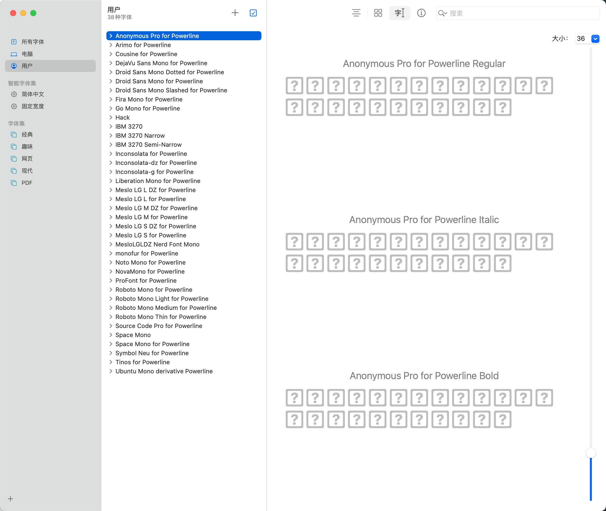

<style>
details {
    border: 1px solid #aaa;
    border-radius: 4px;
    padding: .5em .5em 0;
}
summary {
    font-weight: bold;
    margin: -.5em -.5em 0;
    padding: .5em;
}
details[open] {
    padding: .5em;
}
details[open] summary {
    border-bottom: 1px solid #aaa;
    margin-bottom: .5em;
}
img {
    pointer-events: none;
}
</style>

<details><summary>目录</summary><p>

- [颜色搭配](#颜色搭配)
- [解决使用中文乱码问题](#解决使用中文乱码问题)
  - [查看可以指定的中文字体](#查看可以指定的中文字体)
    - [查找系统已安装的中文字体](#查找系统已安装的中文字体)
    - [查找 Matplotlib 可以使用的中文字体](#查找-matplotlib-可以使用的中文字体)
    - [在系统上安装中文字体](#在系统上安装中文字体)
  - [指定中文字体名称](#指定中文字体名称)
    - [Matplotlib rc 设置全局字体](#matplotlib-rc-设置全局字体)
    - [在画图函数中使用字体名称](#在画图函数中使用字体名称)
  - [指定中文字体的具体路径](#指定中文字体的具体路径)
- [解决其他乱码问题](#解决其他乱码问题)
  - [负号的乱码问题](#负号的乱码问题)
  - [支持数学符号](#支持数学符号)
- [双坐标轴](#双坐标轴)
- [图像风格设置](#图像风格设置)
</p></details><p></p>

# 颜色搭配


# 解决使用中文乱码问题

在使用 Matplotlib 画图的时候，发现一些 Unicode 字符(例如，汉字) 无法正常显示：在生成的图片中，
汉字是乱码的，显示为一个方框。经过大量的查找和阅读，
终于明白了如何在使用 Matplotlib 时，正确渲染 Unicode 字符

之所以中文字符被显示为方框，是因为 Matplotlib 默认使用的字体并不支持中文字符，
并不是 Matplotlib 本身的原因。为了能够在图片上正确显示中文字符，
需要指示 Matplotlib 使用一种支持中文的字体即可。
或者，更直接地，在画图时可以直接给 Matplotlib 提供一个中文字体的路径

## 查看可以指定的中文字体

### 查找系统已安装的中文字体

Matplotlib 提供了 `FontManager` 类来处理字体相关的操作，这个类有一个 `ttflist` 属性，
该属性提供了 Matplotlib 所能够发现到的字体列表。从这个字体列表，可以很容易得到这些字体的名称。
问题是，不清楚这些字体中有哪些字体是支持中文的。这时，需要使用 `fc-list` 命令行工具帮助找到系统上安装的中文字体。
如果系统上没有 `fc-list` 命令，应该先安装 [fontconfig](https://www.freedesktop.org/wiki/Software/fontconfig/)

```bash
$ fc-list :lang=zh
```

* Linux/macOS: 在 Linux/macOS 系统上，`fc_list` 程序通常是自带的，无需安装
* 在 Windows 系统上，可以安装 MiKTeX 或 Tex Live 来使用 `fc-list` 命令

### 查找 Matplotlib 可以使用的中文字体

使用 `fc-list :lang=zh` 可以列出系统上可用的中文字体，值的注意的是，这些中文字体并非都可以被 Matplotlib 使用，
Matplotlib 无法使用其中的 ttc(TrueType Collection) 格式的字体，
所以需要得到 Matplotlib 索引的字体和系统提供的中文字体两个集合的交集

```python
import matplotlib.font_manager import FontManager

fm = FontManager()
mat_fonts = set(f.name for f in fm.ttflist)
print(mat_fonts)
```

### 在系统上安装中文字体

在开始下面步骤之前，确保你的系统上已经安装了中文字体，如果你使用的是中文系统，
这应该不是问题；或者如果你想使用一种新的中文字体，
可以尝试 Google 和 Adobe 发布的 [Source Han Serif](https://source.typekit.com/source-han-serif/)

* macOS 中安装、停用字体
    - https://support.apple.com/zh-cn/HT201749
* macOS 中字体册
    

## 指定中文字体名称

第一种使用中文的方式是给 Matplotlib 提供一个有效的中文字体名，有两种方式

### Matplotlib rc 设置全局字体

第一种方式是，使用 `rcParams` 设置全局中文字体名。
找到了 Matplotlib 索引的中文字体以后，
可以通过更改 Matplotlib rc 指示 Matplotlib 使用中文字体。
这样设置以后，后续脚本中的画图语句都会使用新指定的中文字体

* Windows/Linux

```python
import matplotlib as mpl

font_name = ["Arial Unicode MS"]
mpl.rcParams["font.family"] = font_name
mpl.rcParams["axes.unicode_minus"] = False

plt.text(0.5, 0.5, s = u"测试")
plt.show()
```

* macOS

```python
import matplotlib as mpl

font_name = ["Arial Unicode MS"]
mpl.rcParams["font.sans-serif"] = font_name
mpl.rcParams["axes.unicode_minus"] = False

plt.text(0.5, 0.5, s = u"测试")
plt.show()
```

### 在画图函数中使用字体名称

第二种方式是，仅想在某个画图命令中使用中文字体，可以在画图命令中指定使用的字体名称

```python
import matplotlib as mpl

font_name = "STKaiti"
mpl.rcParams["axes.unicode_minus"] = False

plt.text(0.5, 0.5, s = u"测试", fontname = font_name)
plt.show()
```

## 指定中文字体的具体路径

为了使用系统中的任何字体，也可以使用第二种方式：直接给 Matplotlib 提供一个字体的路径

Ubuntu:

```python
import matplotlib.pyplot as plt
import matplotlib.font_manager as mfm

font_path = "/usr/share/fonts/custom/simhei.ttf"
prop = mfm.FontProperties(fname = font_path)

plt.text(0.5, 0.5, s = u"测试", fontproperties = prop)
plt.show()
```

Windows:

```python

```

macOS:

```python

```

# 解决其他乱码问题

## 负号的乱码问题

```python
import matplotlib as mpl

mpl.rcParams["axes.unicode_minus"] = False # 解决图像中的 “-” 负号的乱码问题
```

## 支持数学符号

```python
from matplotlib import rc

rc('mathtext', default = 'regular')  # 支持数学符号
```

# 双坐标轴

```python
import matplotlib as mpl
import matplotlib.pyplot as plt
from matplotlib import rc


# style
plt.style.use("classic")
plt.style.use("seaborn-whitegrid")
# font
plt.rcParams['font.sans-serif']= ["Arial Unicode MS"] # 支持中文(macOS)
# minus
mpl.rcParams["axes.unicode_minus"] = False # 解决图像中的 “-” 负号的乱码问题
# math
rc('mathtext', default = 'regular')  # 支持数学符号


def timeseries_plot_two_yaxis(df, 
                              col_xaxis,
                              col_left, col_right, 
                              col_left_ylim, col_right_ylim, 
                              title, imgpath):
    fig = plt.figure(figsize = (20, 7))

    # 左坐标轴画图
    ax = fig.add_subplot(111)
    line1 = ax.plot_date(
        df[col_xaxis], 
        df[col_left], 
        linestyle = "solid", 
        color = "#FF4700", 
        label = col_left
    )
    # 右坐标轴画图
    ax2 = ax.twinx()
    line2 = ax2.plot_date(
        df[col_xaxis], 
        df[col_right], 
        linestyle = "solid", 
        color = "#009AFF", 
        label = col_right
    )
    # 图例
    lines = line1 + line2
    labs = [line.get_label() for line in lines]
    ax.legend(lines, labs, loc = 0)
    
    # 日期设置
    plt.gcf().autofmt_xdate()
    plt.gca().xaxis.set_major_formatter(
        mpl_dates.DateFormatter('%Y-%m-%d')
    )
    
    # x 轴标签
    ax.grid()
    ax.set_xlabel(col_xaxis)

    # 左坐标轴设置
    ax.set_ylabel(col_left)
    ax.set_ylim(col_left_ylim)
    ax.set_xticks()
    ax.set_yticks()
    # 右坐标轴设置
    ax2.set_ylabel(col_right)
    ax2.set_ylim(col_right_ylim)
    ax2.xticks()
    ax2.yticks()
    
    # 标题
    plt.title(title)
    
    # 保存
    if imgpath:
        plt.savefig(os.path.join(os.path.dirname(__file__), imgpath))
```

# 图像风格设置

