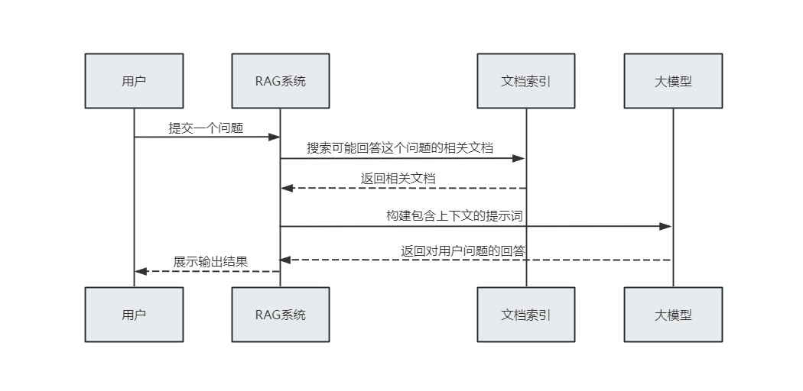

目录

- [RAG 介绍](#rag-介绍)
- [RAG 流程](#rag-流程)
- [RAG 模块](#rag-模块)
    - [向量化](#向量化)
    - [文档加载和切分](#文档加载和切分)
    - [数据库和向量检索](#数据库和向量检索)
    - [大模型模块](#大模型模块)
- [RAG Demo](#rag-demo)
- [RAG 组件](#rag-组件)
    - [LangChian](#langchian)
    - [LlamaIndex](#llamaindex)
    - [dify](#dify)
- [参考](#参考)

# RAG 介绍

尽管大模型对世界有着广泛的认识，但它们并非全知全能。由于训练这些模型需要耗费大量时间，
因此它们所依赖的数据可能已经过时。此外，大模型虽然能够理解互联网上的通用事实，
但往往缺乏对特定领域或企业专有数据的了解，而这些数据对于构建基于 AI 的应用至关重要。
在大模型出现之前，微调(fine-tuning)是一种常用的扩展模型能力的方法。
然而，随着模型规模的扩大和训练数据数据量的增加，微调变得越来越不适用于大多数情况，
除非需要模型以指定风格进行交流或充当领域专家的角色，
一个显著的例子是 OpenAI 将补全模型 GPT-3.5 改进为新的聊天模型 ChatGPT，
微调效果出色。微调不仅需要大量的高质量数据，还消耗巨大的计算资源和时间，
这对于许多个人和企业用户来说是昂贵且稀缺的资源。
因此，研究如何有效地利用专有数据来辅助大模型生成内容，成为了学术界和工业界的一个重要领域。
这不仅能够提高模型的实用性，还能够减轻对微调的依赖，使得 AI 应用更加高效和经济。

LLM 会产生误导性的 “幻觉”，依赖的信息可能过时，处理特定知识时效率不高，
缺乏专业领域的深度洞察，同时在推理能力上也有所欠缺。正是在这样的背景下，
检索增强生成技术（Retrieval-Augmented Generation，RAG）应时而生，
成为 AI 时代的一大趋势。RAG 技术基于提示词(prompt)，
最早由 Facebook AI 研究机构(FAIR)与其合作者于 2021 年发布的论文 “Retrieval-Augmented Generation for Knowledge-Intensive NLP Tasks” 中提出，RAG 的作用是帮助模型查找外部信息以改善其响应。
RAG 技术十分强大，它已经被必应搜索、百度搜索以及其他大公司的产品所采用，
旨在将最新的数据融入其模型。在没有大量新数据、预算有限或时间紧张的情况下，
这种方法也能取得不错的效果，而且它的原理足够简单。

RAG 结合了检索（从大型文档系统中获取相关文档片段）和生成（模型使用这些片段中的信息生成答案）两部分。
RAG 通过在语言模型生成答案之前，先从广泛的文档数据库中检索相关信息，
然后利用这些信息来引导生成过程，极大地提升了内容的准确性和相关性。
RAG 有效地缓解了幻觉问题，提高了知识更新的速度，并增强了内容生成的可追溯性，
使得大型语言模型在实际应用中变得更加实用和可信。

RAG 主要在以下三方面弥补了大模型的一些缺陷：

* 知识更新
    - 大型预训练语言模型在训练数据停止更新后，其知识也会停止更新。
      RAG 通过在生成过程中实时检索最新的文档或信息，来提供更加准确和时效性强的回答。
* 引用外部数据
    - 传统的生成模型仅能依赖其训练数据中的知识。RAG 通过检索外部数据源，
      能够引用模型训练数据之外的信息。
* 提高准确性
    - 模型在生成回答时，RAG 技术能够利用检索到的文档来提高回答的准确性。

# RAG 流程

RAG 基本流程：

RAG 技术在具体实现方式上可能有所变化，但在概念层面，将其融入应用通常包括以下几个步骤（见下图）：

1. 用户提交一个问题
2. RAG 系统搜索可能回答这个问题的相关文档。这些文档通常包含了专有数据，
   并被存储在某种形式的文档索引里
3. RAG 系统构建一个提示词，它结合了用户输入、相关文档以及对大模型的提示词，
   引导其使用相关文档来回答用户的问题
4. RAG 系统将这个提示词发送给大模型
5. 大模型基于提供的上下文返回对用户问题的回答，这就是系统的输出结果

RAG 技术在具体实现方式上基本流程是：

1. 索引：将文档库分割成较短的 Chunk，并通过编码器构建向量索引
2. 根据问题和 Chunk 的相似度检索相关文档片段
3. 以检索到的上下文为条件，生成问题的答案

# RAG 模块

* 一个向量化模块，用来将文档片段向量化
* 一个文档加载和切分的模块，用来加载文档并切分成文档片段
* 一个数据库来存放文档片段和对应的向量表示
* 一个检索模块，用来根据 Query(问题) 检索相关的文档片段
* 一个大模型模块，用来根据检索出来的文档回答用户的问题

## 向量化

> Embedding

手动实现一个向量化的类，这是 RAG 架构的基础。向量化的类主要用来将文档片段向量化，
将一段文本映射为一个向量。这里设置一个 `Embedding` 基类，
这样我们在用其他的 Embedding 模型的时候，只需要继承这个基类，
然后在此基础上进行修改即可，方便代码扩展。

## 文档加载和切分

接下来实现一个文档加载、切分的类，这个类主要是用来加载文档并切分成文档片段。

那么需要切分什么文档呢？这个文档可以是一篇文章、一本书、一段对话、一段代码等等。
这个文档的内容可以是任何的，只要是文本就行，比如：PDF 文件、MD 文件、TXT 文件等。

把文件内容都读取之后，还需要切分。按 Token 的长度来切分文档。
可以设置一个最大的 Token 长度，然后根据这个最大的 Token 长度来切分文档。
这样切分出来的文档片段就是一个一个的差不多相同长度的文档片段了。
不过在切分的时候要注意，片段与片段之间最好要有一些重叠的内容，
这样才能保证检索的时候能够检索到相关的文档片段。
还有就是切分文档的时候最好以句子为单位，也就是按 `\n` 进行粗切分，
这样可以基本保证句子内容是完整的。

## 数据库和向量检索

做好了文档切分后，也做好了 Embedding 模型的加载。
接下来就得设计一个向量数据库用来存放文档片段和对应的向量表示了。

并且需要设计一个检索模块，用来根据 Query （问题）检索相关的文档片段。

一个数据库对于最小 RAG 架构来说，需要实现几个功能:

* persist：数据库持久化，本地保存
* load_vector：从本地加载数据库
* get_vector：获得文档的向量表示
* query：根据问题检索相关的文档片段

以上四个模块就是一个最小的 RAG 结构数据库需要实现的功能

query 方法具体实现：

1. 首先，先把用户提出的问题向量化
2. 然后, 在数据库中检索相关的文档片段
3. 最后返回检索到的文档片段

在向量检索的时候仅使用 Numpy 进行加速。

## 大模型模块

这个模块主要是用来根据检索出来的文档回答用户的问题。

# RAG Demo

# RAG 组件

## LangChian

在实际的生产环境中，通常会面对来自多种渠道的数据，其中很大一部分是复杂的非机构化数据，
处理这些数据，特别是提取和预处理，往往是耗费精力的任务之一。

## LlamaIndex

## dify

# 参考

* [动手做一个最小RAG——TinyRAG](https://mp.weixin.qq.com/s?__biz=MzIyNjM2MzQyNg==&mid=2247660972&idx=1&sn=0bf6fe4d0854015d18263b49cd7b81ef&chksm=e98387af128051c9cb6914cee71626e5afb79ab8439966c508999270ca5b4048ad51a386fc2f&scene=0&xtrack=1)
* [GitHub](https://github.com/KMnO4-zx/TinyRAG)
