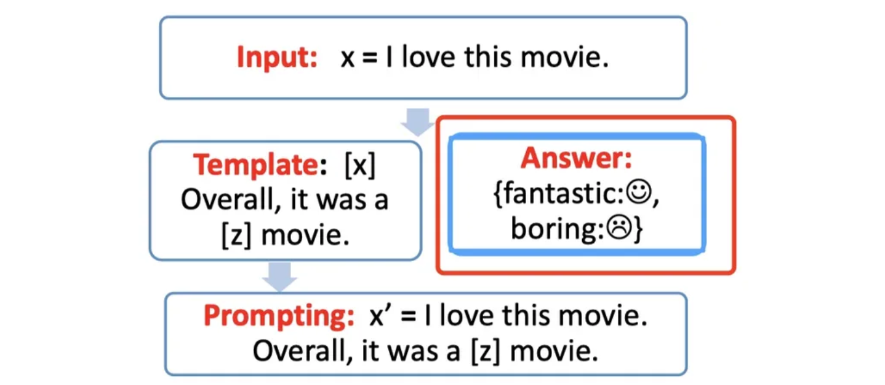
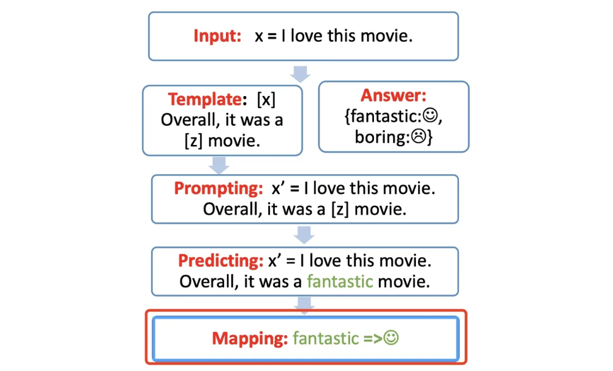

<style>
details {
    border: 1px solid #aaa;
    border-radius: 4px;
    padding: .5em .5em 0;
}
summary {
    font-weight: bold;
    margin: -.5em -.5em 0;
    padding: .5em;
}
details[open] {
    padding: .5em;
}
details[open] summary {
    border-bottom: 1px solid #aaa;
    margin-bottom: .5em;
}
img {
    pointer-events: none;
}
</style>

<details><summary>目录</summary><p>

- [预训练模型和 Prompt](#预训练模型和-prompt)
    - [预训练模型](#预训练模型)
    - [Promot](#promot)
    - [Prompt 工作流](#prompt-工作流)
        - [Prompt construction-\[Template\]](#prompt-construction-template)
        - [Answer construction-\[Verbalizer\]](#answer-construction-verbalizer)
        - [Answer prediction-\[Prediction\]](#answer-prediction-prediction)
        - [Answer-label mapping-\[Mapping\]](#answer-label-mapping-mapping)
        - [总结](#总结)
    - [Prompt-based 方法的工程选择问题](#prompt-based-方法的工程选择问题)
        - [Prompt Template Engineering](#prompt-template-engineering)
        - [Answer Engineering](#answer-engineering)
- [提示工程](#提示工程)
    - [提示工程简介](#提示工程简介)
    - [模型设置](#模型设置)
    - [基础提示词](#基础提示词)
    - [提示词格式](#提示词格式)
        - [零样本提示](#零样本提示)
        - [少样本提示](#少样本提示)
    - [提示词要素](#提示词要素)
    - [设计提示的通用技巧](#设计提示的通用技巧)
    - [提示词示例](#提示词示例)
        - [文本概括](#文本概括)
        - [信息提取](#信息提取)
        - [问答](#问答)
        - [文本分类](#文本分类)
        - [对话](#对话)
        - [代码生成](#代码生成)
        - [推理](#推理)
- [提示技术](#提示技术)
    - [零样本提示](#零样本提示-1)
    - [少样本提示](#少样本提示-1)
    - [链式思考(CoT)提示](#链式思考cot提示)
- [提示应用](#提示应用)
- [Prompt Hub](#prompt-hub)
- [模型](#模型)
- [风险和误用](#风险和误用)
- [LLM 研究](#llm-研究)
- [参考](#参考)
</p></details><p></p>

# 预训练模型和 Prompt

## 预训练模型

首先，需要了解什么是预训练模型，以及其带来的 Prerain + Fine-tuning 的范式。

在很长的一段时间内，NLP 的任务采用的都是 Pretrain + Fine-tuning(Model Tuning)的解决方案，
但是这种方案，需要对每个任务都重新 fine-tune 一个新的模型，且不能共用。
但是对于一个预训练的大语言模型来说，这就仿佛好像是对于每个任务都进行了定制化，十分不高效。
是否存在一种方式，可以将预训练模型作为电源，不同的任务当做电器，仅需要根据不同的电器（任务），
选择不同的适配器，对于模型来说，即插入不同的任务特定的参数就可以使得模型适配下游任务。
Prompt Learning 就是这个适配器，它能高效地进行预训练模型的使用。这种方式大大提升了预训练模型的使用率，如下图：


* 左边是传统的 Model Tuning 的范式：对于不同的任务，都需要将整个预训练模型进行精调，
  每个任务都有自己的一整套参数。
* 右边是 Prompt Tuning，对于不同的任务，仅需要插入不同的 Prompt 参数，
  每个任务都单独训练 Prompt 参数，不训练预训练语言模型，这样子可以大大缩短训练时间，也极大的提升了模型的使用率。

## Promot

所以什么是 Prompt？字面上来讲，Prompt 就是提示。比如有人忘记了某个事情，我们给予特定的提示，
他就可以想起来，例如我们说：`白日依山尽，`，大家自然而然地会想起来下一句诗：`黄河入海流`。
或者，搜索引擎可以根据我们的输入进行输出的提示：


在 NLP 中，Prompt 代表的是什么呢？

> Prompt 就是给预训练模型的一个线索/提示，帮助它可以更好地理解人类的问题。

例如，下图的 BERT、BART、ERNIE 均为预训练模型，对于人类提出的问题，以及线索，
预训练语言模型可以给出正确的答案。


* 根据提示，BERT 能回答 JDK 是 Oracle 研发的
* 根据 TL;DR: 的提示，BART 知道人类想要问的是文章的摘要
* 根据提示，ERNIE 知道人类想要问鸟类的能力：飞行

Prompt 更严谨的定义如下：

> Prompt is the technique of making better use of the knowledge from the pre-trained model by adding additional texts to the input.
>
> Prompt 是一种为了更好地使用预训练模型的知识，采用在输入段添加额外的文本的技术。
> 
> 目的：更好地挖掘预训练语言模型的能力
> 手段：在输入端添加文本，即重新定义任务（task reformulation）

## Prompt 工作流


Prompt 的工作流包含以下四部分：

1. Template
    - Prompt 模版（Template）的构造
2. Answer
    - Prompt 答案空间映射（Verbalizer）的构造
    - `predict text: label`
3. Prompt/Predicting
    - 文本代入 Prompt 模板，并且使用预训练语言模型进行预测
4. Mapping
    - 将预测的结果映射回 Label

### Prompt construction-[Template]

首先，需要构建一个模版，模板的作用是将输入和输出进行重新构造，
变成一个新的带有 mask slots 的文本，具体如下：

* 定义一个模板，包含了两处待填入的 slots：`[x]` 和 `[z]`
* 将 `[x]` 用输入文本代入

例如：

* 输入：`x = 我喜欢这个电影。`
* 模版：`[x]总而言之，它是一个[z]电影`
* 代入(prompting)：`我喜欢这个电影。总而言之，它是一个[z]电影`


### Answer construction-[Verbalizer]

对于构造的 Prompt，我们需要知道 **预测词** 和 **label** 之间的关系，
并且也不可能运行 `z` 是任意词，这边就需要一个映射函数(mapping function)将 **输出词** 与 **label** 进行映射。

例如上述例子，输出的 label 有两个，一个是 `fantastic 脸`，一个是 `borning 脸`。
我们可以限定，如果预测词是 `fantastic`，则对应 `fantastic 脸`，
如果是 `boring` 则对应 `borning 脸`。




### Answer prediction-[Prediction]

这一步就只需要选择合适的预训练模型，然后进行 mask slot `[z]` 的预测。
例如下图，得到了结果 `fantastic`，需要将其代入 `[z]` 中


### Answer-label mapping-[Mapping]

对于得到的 answer，需要用 `Verbalizer` 将其映射回原本的 `label`。
例如：`fantastic` 映射回 `label`。



### 总结


## Prompt-based 方法的工程选择问题

在知乎中有个提问：“现代的 deep learning 就是为了规避 feature engineering”，
可是 prompt 这边选择了 `template` 和 `answer` 不还是 feature engineering 吗？
从这个问题中可以发现，确实如果使用 BERT 的 fine-tuning 范式（下图左），
我们是不需要使用任何的人工特征构造，而使用 prompt-based 的方法的话，
需要人工参与的部分包含了以下部分：

* `template` 构造
* `answer` 构造
* 预训练模型选择
* prompt 的组合问题选择
* 以及训练策略的选择等


下面会先进行每个需要人工 engineering 的部分进行详细讲解，然后再分析为什么我们还需要 prompt 这种范式。

### Prompt Template Engineering

> Prompt 模板工程

如何构造合适的 Prompt 模板？对于同一个任务，不同的人可能构造不同的 Template。
且每个模板都具有合理性。


Template 的选择，对于 Prompt 任务起到了很重大的作用，就算一个 word 的区别，也可能导致十几个点的效果差别，
论文 [GPT Understands, Too](https://arxiv.org/abs/2103.10385) 给出了如下的结果：


对于不同的 template，可以从以下两种角度进行区分：

1. 根据 slot 的 `形状/位置` 区分
    - 完形填空(Cloze)的模式，即未知的 slot 在 template 的中间等不定的位置
    - 前缀模式(Prefix)，未知的 slot 在 template 的开头
2. 根据 `是否是由人指定的` 来区分
    - 人工指定 template
    - 自动搜索 template
        - 离散(discrete) template，即搜索的空间是离散的，为预训练语言模型的字典里的字符
        - 连续(continuous) template，即搜索的空间是连续的，
        因为所有新增的这些 prompt 的参数主要是为了让机器更好地服务于任务，
        所以其参数地取值空间不需要限定在特定地取值范围内，可以是连续地空间

具体地思维导图如下：


### Answer Engineering

> 答案工程

在给定一个任务或者 prompt 时，如何对 label 空间和 answer 空间进行映射？


# 提示工程

## 提示工程简介

提示工程（Prompt Engineering）是一门较新的学科，关注提示词开发和优化，
帮助用户将大语言模型（Large Language Model, LLM）用于各场景和研究领域。
掌握了提示工程相关技能将有助于用户更好地了解大型语言模型的能力和局限性。

* 研究人员可利用提示工程来提升大语言模型处理复杂任务场景的能力，如问答和算术推理能力。
* 开发人员可通过提示工程设计、研发强大的工程技术，实现和大语言模型或其他生态工具的高效接轨。

提示工程不仅仅是关于设计和研发提示词。它包含了与大语言模型交互和研发的各种技能和技术。
提示工程在实现和大语言模型交互、对接，以及理解大语言模型能力方面都起着重要作用。
用户可以通过提示工程来提高大语言模型的安全性，也可以赋能大语言模型，
比如借助专业领域知识和外部工具来增强大语言模型能力。

## 模型设置

测试环境：

* OpenAPI Playground
* 模型：`gpt-3.5-turbo`
* 模型配置：
    - `temperature = 1`
    - `top_p = 1`

使用提示词时，可以通过 API 或直接与大语言模型进行交互。你可以通过配置一些参数以获得不同的提示结果。
调整这些设置对于提高响应的可靠性非常重要，你可能需要进行一些实验才能找出适合您的用例的正确设置。
以下是使用不同 LLM 提供程序时会遇到的常见设置：

* Temperature：简单来说，temperature 的参数值越小，模型就会返回越确定的一个结果。
  如果调高该参数值，大语言模型可能会返回更随机的结果，也就是说这可能会带来更多样化或更具创造性的产出。
  我们目前也在增加其他可能 token 的权重。在实际应用方面，对于质量保障（QA）等任务，
  我们可以设置更低的 temperature 值，以促使模型基于事实返回更真实和简洁的结果。
  对于诗歌生成或其他创造性任务，你可以适当调高 temperature 参数值。
* Top_p：同样，使用 top_p（与 temperature 一起称为核采样的技术），可以用来控制模型返回结果的真实性。
  如果你需要准确和事实的答案，就把参数值调低。如果你想要更多样化的答案，就把参数值调高一些。
  一般建议是改变 Temperature 和 Top P 其中一个参数就行，不用两个都调整。
* Max Length：您可以通过调整 max length 来控制大模型生成的 token 数。
  指定 Max Length 有助于防止大模型生成冗长或不相关的响应并控制成本。
* Stop Sequences：stop sequence 是一个字符串，可以阻止模型生成 token，
  指定 stop sequences 是控制大模型响应长度和结构的另一种方法。
  例如，您可以通过添加 “11” 作为 stop sequence 来告诉模型生成不超过 10 个项的列表。
* Frequency Penalty：frequency penalty 是对下一个生成的 token 进行惩罚，
  这个惩罚和 token 在响应和提示中出现的次数成比例，frequency penalty 越高，
  某个词再次出现的可能性就越小，这个设置通过给 重复数量多的 Token 设置更高的惩罚来减少响应中单词的重复。
* Presence Penalty：presence penalty 也是对重复的 token 施加惩罚，但与 frequency penalty 不同的是，
  惩罚对于所有重复 token 都是相同的。出现两次的 token 和出现 10 次的 token 会受到相同的惩罚。
  此设置可防止模型在响应中过于频繁地生成重复的词。如果您希望模型生成多样化或创造性的文本，
  您可以设置更高的 presence penalty，如果您希望模型生成更专注的内容，您可以设置更低的 presence penalty。

与 `temperature` 和 `top_p` 一样，一般建议是改变 `frequency penalty` 和 `presence penalty` 其中一个参数就行，
不要同时调整两个。

## 基础提示词

可以通过简单的提示词（Prompts）获得大量结果，但结果的质量与提供的信息数量和完善度有关。
一个提示词可以包含传递到模型的 **指令** 或 **问题** 等信息，
也可以包含其他详细信息，如 **上下文**、**输入** 或 **示例** 等。
可以通过这些元素来更好地指导模型，并因此获得更好的结果。

提示工程（Prompt Engineering）就是探讨如何设计出最佳提示词，
用于指导语言模型帮助我们高效完成某项任务。

## 提示词格式

### 零样本提示

标准提示词应该遵循以下格式：

```
<问题>?
```

或：

```
<指令>
```

这种可以被格式化为标准的问答格式，如：

```
Q: <问题>?
A:
```

以上的提示方式，也被称为 **零样本提示（zero-shot prompting）**，
即用户不提供任务结果相关的示范，直接提示语言模型给出任务相关的回答。
某些大型语言模式有能力实现零样本提示，但这也取决于任务的复杂度和已有的知识范围。

具体的 zero-shot prompting 示例如下：

```
Q: what is prompt engineering?
```

对于一些较新的模型，你可以跳过 `Q:` 部分，直接输入问题。
因为模型在训练过程中被暗示并理解问答任务，换言之，提示词可以简化为下面的形式：

```
what is prompt engineering?
```

### 少样本提示

基于以上标准范式，目前业界普遍使用的还是更高效的 **少样本提示（Few-shot Prompting）** 范式，
即用户提供少量的提示范例，如任务说明等。少样本提示一般遵循以下格式：

```
<问题>?
<答案>
<问题>?
<答案>
<问题>?
<答案>
<问题>?
```

而问答模式即：

```
Q: <问题>?
A: <答案>
Q: <问题>?
A: <答案>
Q: <问题>?
A: <答案>
Q: <问题>?
A:
```

注意，使用问答模式并不是必须的。你可以根据任务需求调整提示范式。
比如，您可以按以下示例执行一个简单的 **分类任务**，并对任务做简单说明：

提示词：

```
This is awesome! // Positive
This is bad! // Negative
Wow that movie was rad! // Positive
What a horrible show! //
```

输出结果：

```
Negative
```

语言模型可以基于一些说明了解和学习某些任务，而少样本提示正好可以赋能上下文学习能力。

## 提示词要素

提示词可以包含以下一些要素：

* 指令
    - 想要模型执行的特定任务或指令
* 上下文
    - 包含外部信息或额外的上下文信息，引导语言模型更好地响应
* 输入数据
    - 用户输入的内容或问题
* 输出指示
    - 指定输出的类型或格式

为了更好地演示提示词要素，下面是一个简单的提示，旨在完成文本分类任务：

```
请将文本分为中性、否定或肯定
文本：我觉得食物还可以。
情绪：
```

在上面的提示示例中：

* 指令是 `"将文本分类为中性、否定或肯定"`。
* 输入数据是 `"我认为食物还可以"` 部分
* 使用的输出指示是 `"情绪："`

此基本示例不使用上下文，但也可以作为提示的一部分提供。
例如，此文本分类提示的上下文可以是作为提示的一部分提供的其他示例，
以帮助模型更好地理解任务并引导预期的输出类型。
注意，提示词所需的格式取决于想要语言模型完成的任务类型，并非所有以上要素都是必须的。

## 设计提示的通用技巧

1. 从简单开始

在设计提示时，需要记住这是一个迭代的过程，需要大量的实验来获得最佳结果。
可以从简单的提示开始，随着我们的目标是获得更好的结果，不断添加更多的元素和上下文。
在此过程中对提示进行版本控制是至关重要的。
许多例子，其中具体性、简洁性和简明性通常会给您带来更好的结果。

当有一个涉及许多不同子任务的大任务时，可以尝试将任务分解为更简单的子任务，
并随着获得更好的结果而不断构建。这避免了在提示设计过程中一开始就添加过多的复杂性。

2. 指令

可以使用命令来指示模型执行各种简单任务，
例如 `“写入”`、`“分类”`、`“总结”`、`“翻译”`、`“排序”` 等，
从而为各种简单任务设计有效的提示。

需要进行大量的实验，以查看哪种方法最有效。尝试使用不同的关键字、
上下文和数据尝试不同的指令，看看哪种方法最适合特定用例和任务。
通常情况下，上下文与要执行的任务越具体和相关，效果越好。

也有人建议将指令放在提示的开头。建议使用一些清晰的分隔符，如 `“###”`，
来分隔 **指令** 和 **上下文**。例如：

提示词：

```
### 指令 ###
将以下文本翻译成西班牙语：

文本：“hello！”
```

输出：

```
¡Hola!
```

3. 具体性

要对希望模型执行的指令和任务非常具体，提示越具体和详细，结果就越好。
当有所期望的结果或生成样式时，这一点尤为重要，没有特定的令牌或关键字会导致更好的结果，
更重要的是具有良好的 **格式** 和 **描述性提示**。
实际上，在提示中 **提供示例** 非常有效，可以以特定格式获得所需的输出。

在设计提示时，还应考虑 **提示的长度**，因为提示的长度有限制。
提示词的具体和详细的程度是需要考虑的，包含太多不必要的细节并不一定是一个好方法。
这些细节应该是相关的，并有助于完成手头的任务，这需要进行大量实验。
这里鼓励大量实验和迭代，以优化应用程序的提示。

下面的示例中，尝试从一段文本中提取特定信息的简单提示：

提示词：

```
提取以下文本中的地名。

所需格式：
地点：<逗号分隔的公司名称列表>

输入：“虽然这些发展对研究人员来说是令人鼓舞的，但仍有许多谜团。里斯本未知的香帕利莫德中心的神经免疫学家 Henrique Veiga-Fernandes 说：“我们经常在大脑和我们在周围看到的效果之间有一个黑匣子。”“如果我们想在治疗背景下使用它，我们实际上需要了解机制。””
```

输出：

```
地点：里斯本，香帕利莫德中心
```

4. 避免不精确

在上面关于详细和格式改进的提示中，很容易陷入想要过于聪明的提示陷阱，
从而可能创建不精确的描述。通常最好是具体和直接。这里就像有效的沟通——越直接，
信息传递就越有效。

例如，如果希望了解提示工程的概念。可以尝试这样做：

```
解释提示工程的概念。保持解释简短，只有几句话，不要过于描述。
```

从上面的提示中不清楚要使用多少句话和什么样的风格，但是仍然可以通过上面的提示获得良好的响应，
但更好的提示是非常具体、简洁和直接的。例如：

```
使用 2-3 句话向高中学生解释提示工程的概念。
```

5. 做还是不做

设计提示时的另一个常见技巧是避免说不要做什么，而是说要做什么。
这鼓励更具体化，并关注导致模型产生良好响应的细节。

以下是一个电影推荐聊天机器人的示例，因为写的指令关注于不要做什么，而失败了：

提示词：

```
以下是向客户推荐电影的代理程序。不要询问兴趣。不要询问个人信息。

客户：请根据我的兴趣推荐电影。
代理：
```

输出：

```
当然，我可以根据您的兴趣推荐电影。您想看什么类型的电影？您喜欢动作片、喜剧片、爱情片还是其他类型的电影？
```

以下是更好的提示词：

提示词：

```
以下是向客户推荐电影的代理程序。代理负责从全球热门电影中推荐电影。它应该避免询问用户的偏好并避免询问个人信息。如果代理没有电影推荐，它应该回答“抱歉，今天找不到电影推荐。”。
```顾客：请根据我的兴趣推荐一部电影。
客服：
```

输出：

```
抱歉，我没有关于您兴趣的任何信息。不过，这是目前全球热门的电影列表：[电影列表]。希望您能找到喜欢的电影！
```

## 提示词示例

### 文本概括


### 信息提取


### 问答


### 文本分类


### 对话


### 代码生成


### 推理


# 提示技术

## 零样本提示

## 少样本提示

## 链式思考(CoT)提示


# 提示应用

# Prompt Hub


# 模型

# 风险和误用


# LLM 研究


# 参考

* [Prompt Learning 超强入门教程](https://zhuanlan.zhihu.com/p/442486331)
* [提示工程指南](https://www.promptingguide.ai/zh)
* [大模型 prompt tuning 技术-上视屏](https://www.bilibili.com/video/BV1Sf4y1g7ra/?from=search&seid=12417442891380693418&spm_id_from=333.337.0.0&vd_source=3239a81863eecfba0d143c5a5ae6d110)
* [大模型 prompt tuning 技术-下视频](https://www.bilibili.com/video/BV1af4y1g7Jz/?spm_id_from=333.999.0.0&vd_source=3239a81863eecfba0d143c5a5ae6d110)
* [Pre-train, Prompt, and Predict: A Systematic Survey of Prompting Methods in Natural Language Processing](https://arxiv.org/pdf/2107.13586)
* [The Fourth Paradigm of Modern Natural Language Processing Techniques](https://blender.cs.illinois.edu/course/fall22/lecture9.pdf)
