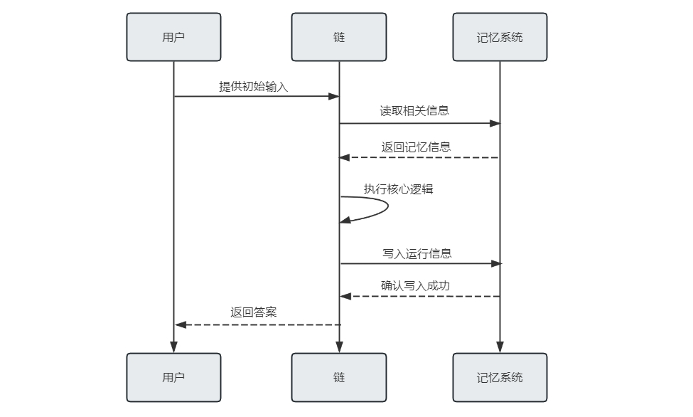
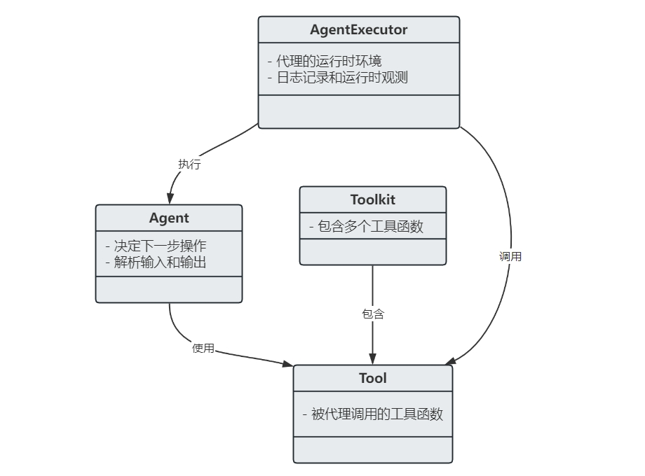

<style>
details {
    border: 1px solid #aaa;
    border-radius: 4px;
    padding: .5em .5em 0;
}
summary {
    font-weight: bold;
    margin: -.5em -.5em 0;
    padding: .5em;
}
details[open] {
    padding: .5em;
}
details[open] summary {
    border-bottom: 1px solid #aaa;
    margin-bottom: .5em;
}
img {
    pointer-events: none;
}
</style>

<details><summary>目录</summary><p>

- [LangChain 简介](#langchain-简介)
    - [类似框架](#类似框架)
    - [简介](#简介)
    - [核心概念](#核心概念)
    - [核心模块](#核心模块)
        - [模型 I/O 模块](#模型-io-模块)
        - [检索模块](#检索模块)
        - [链模块](#链模块)
        - [记忆模块](#记忆模块)
        - [代理模块](#代理模块)
        - [回调模块](#回调模块)
    - [LangChain 生态](#langchain-生态)
- [LangChain 快速使用](#langchain-快速使用)
    - [LangChain 环境安装](#langchain-环境安装)
        - [开发环境](#开发环境)
        - [langchain 库安装](#langchain-库安装)
        - [其他库安装](#其他库安装)
    - [构建一个简单的 LLM 应用](#构建一个简单的-llm-应用)
        - [语言模型](#语言模型)
            - [简介](#简介-1)
            - [示例](#示例)
        - [提示模版](#提示模版)
            - [简介](#简介-2)
            - [示例](#示例-1)
        - [输出解析器](#输出解析器)
            - [简介](#简介-3)
            - [示例](#示例-2)
        - [使用 LCEL 进行组合](#使用-lcel-进行组合)
            - [LCEL](#lcel)
            - [示例](#示例-3)
        - [使用 LangSmith 进行观测](#使用-langsmith-进行观测)
        - [使用 LangServe 提供服务](#使用-langserve-提供服务)
            - [简介](#简介-4)
            - [示例](#示例-4)
    - [最佳安全实践](#最佳安全实践)
- [模型输入与输出](#模型输入与输出)
    - [大模型输入与输出](#大模型输入与输出)
    - [提示模板组件](#提示模板组件)
        - [基础提示模板](#基础提示模板)
        - [自定义提示模板](#自定义提示模板)
        - [使用 FewShotPromptTemplate](#使用-fewshotprompttemplate)
    - [输出解析器](#输出解析器-1)
- [大模型接口](#大模型接口)
    - [聊天模型](#聊天模型)
    - [聊天模型提示词的构建](#聊天模型提示词的构建)
    - [定制大模型接口](#定制大模型接口)
    - [扩展模型接口](#扩展模型接口)
- [链的构建](#链的构建)
- [RAG](#rag)
- [智能代理设计](#智能代理设计)
- [记忆组件](#记忆组件)
- [回调机制](#回调机制)
- [构建多模态机器人](#构建多模态机器人)
- [参考和资源](#参考和资源)
</p></details><p></p>

# LangChain 简介

## 类似框架

* crewAI
* LangChain
* LlamaIndex
* SK
* AutoGPT

## 简介

ChatGPT 的巨大成功激发了越来越多的开发者兴趣，他们希望利用 OpenAI 提供的 API 或者私有化模型，
来开发基于大型语言模型的应用程序。尽管大型语言模型的调用相对简单，但要创建完整的应用程序，
仍然需要大量的定制开发工作，包括 API 集成、互动逻辑、数据存储等等。
为了解决这个问题，从 2022 年开始，许多机构和个人相继推出了多个开源项目，
旨在帮助开发者们快速构建基于大型语言模型的端到端应用程序或工作流程。
其中一个备受关注的项目就是 LangChain 框架。

LangChain 框架是一个开源工具，充分利用了大型语言模型的强大能力，以便开发各种下游应用。
它的目标是为各种大型语言模型应用提供通用接口，从而简化应用程序的开发流程。
具体来说，LangChain 框架可以实现数据感知和环境互动，也就是说，
它能够让语言模型与其他数据来源连接，并且允许语言模型与其所处的环境进行互动。

## 核心概念


LangChain 作为一种大模型应用开发框架，针对当前 AI 应用开发中的一些关键挑战提供了有效的解决方案，
概述如下：

* 数据时效性
    - LangChain 可以通过集成外部知识库和向量数据库，允许开发者将最新的数据和信息注入模型中，
      从而提高应用的时效性。 
* token 数量限制
    - LangChain 通过优化提示词和链的管理，帮助开发者突破模型 token 数量限制，例如通过分块处理长文档，
      或者使用特定的提示模版来引导模型生成更有效的输出。
* 网络连接限制
    - 大语言模型本身无法联网查询，但 LangChain 可以作为中间件，
      帮助开发者将模型与实时数据源连接起来，
      例如通过 API 调用获取最新的信息，然后将这些信息作为输入传递给模型。
* 数据源整合限制
    - LangChain 支持与多种数据源的整合，包括私有数据库、API 和其他第三方工具，
      这使得开发者能够构建更加灵活和多样化的应用，充分利用不同数据源的优化。

LangChain 是一个专为开发大模型驱动的应用而设计的框架，它赋予应用程序以下特性：

* 能够理解和适应上下文
    - 将大模与各种上下文信息（如提示指令、小样本示例、外挂知识库内容等）相结合，
      使之能够根据不同情境做出响应。
* 具备推理能力
    - 依靠大模型进行推理分析，以决定如何基于提供的上下文信息做出回答或采取相应行动。

LangChain 的核心优势包括两个方面：

* 组件化
    - 提供一系列工具和集成模块，既可以单独使用，也可与 LangChain 框架其他部分结合，
      提高与大模型协作的效率和灵活性。
* 现成的链
    - 内置多个组件组合，专为处理复杂任务设计，提供即插即用的高级功能。

LangChain 通过组件化和现成的链，降低了使用大模型构建应用的门槛，可以适应广泛的应用场景。
得益于最初设计中足够的抽象层次，LangChain 能够与大模型应用形态的演进保持同步。
应用形态的总体迭代过程概述如下：

* 入门阶段
    - 构建以单一提示词为中心的应用程序
* 进阶阶段
    - 通过组合一系列提示词创建更复杂的应用
* 发展阶段
    - 开发由大模型驱动的智能代理（agent）应用
* 探索阶段
    - 实现多个智能代理（agent）协同工作，以应对高度复杂的应用场景

## 核心模块

LangChain 使用以下 6 种核心模块提供标准化、可扩展的接口和外部集成，
分别是：模型 I/O(Model I/O)模块、检索(Retrieval)模块、链(Chain)模块、
记忆(Memory)模块、代理(Agent)模块和回调(Callback)模块。

在 LangChain 的组件系统中，各个模块相互协作，共同构建复杂的大模型应用。模型 I/O 模块确保与语言模型高效变互，
包括输入提示管理和输出解析。检索模块补充了这一流程，为生成过程提供必要的外部知识，提高了模型的响应质量。
紧随其后的链模块，通过定义一系列组件调用，将模型 I/O 模块和检索模块的功能事联起来，实现特定的业务逻辑。
记忆模块为链提供了记忆功能，以维持应用的状态，并且在整个应用运行期间管理信息流。
代理模块进一步增强了 LangChain 的灵活性，通过智能代理动态地决定行动的序列，这些代理利用了前述所有模块的能力。
最后，回调模块以其全局和请求级别的自定义处理逻辑，为开发者构建应用提供了细粒度的控制和响应能力。
正是这些能力的结合，Langehain 的真正潜力得以释放，使开发者能够构建出响应迅速、高度定制的 AI 应用。

### 模型 I/O 模块

模型 I/O 模块主要与大模型交互相关，由三个部分组成：

1. **提示词管理部分**用于模块化，动态选择和管理模型输入；
2. **语言模型部分**通过调用接口调用大模型；
3. **输出解析器**负责从模型输出中提取信息。

### 检索模块

LangChain 提供了一个 **检索增强生成**(retrieval-augmented generation, RAG)模块。

* 从外部检索 **用户特定数据** 并将其整合到大模型中，包括超过 100 种 **文档加载器**，
  可以从各种 **数据源（如私有数据库/公共网站以及企业知识库等）** 加载 **不同格式(HTML、PDF、Word、Excel、图像等)的文档**。
* 为了提取文档的相关部分，**文档转换器引擎** 可以将大文档分割成小块。
  检索模块提供了多种算法和针对特定文档类型的优化逻辑。
* **文本嵌入模型** 也是检索过程的关键组成部分，它们可以捕捉文本的语义从而快速找到相似的文本。
  检索模块集成了多种类型的嵌入模型，并提供标准接口以简化模型间的切换。
* 为了高效存储和搜索嵌入向量，检索模块与超过 50 种 **向量存储引擎**集成，
  既支持开源的本地向量数据库，也可以接入云厂商托管的私有数据库。
  开发者可以根据需要，通过标准接口灵活地在不同的向量存储之间切换。

检索模块扩展了 LangChain 的功能，允许从外部数据源种提取并整合信息，
增强了语言模型的回答能力。这种增强生成的能力为链模块种的复杂应用场景提供了支持。

### 链模块

链定义为对一系列组件的组合调用。既可以在处理简单应用时单独使用链，
也可以在处理复杂应用时将多个链和其他组件组合起来进行链式连接。

LangChain 提供了两种方式来实现链：

1. 早期的 **Chain 编程接口**
    - 是一种命令式编程
2. 最新的 **LangChain 表达式（LangChain Expression Language, LCEL）**
    - 是一种声明式编程
    - 官方推荐使用 LCEL 的方式构建链。LCEL 的核心优势在于提供了直观的语法，
      并支持流式传输、异步调用、批处理、并行化、重试和追踪等特性
    - 通过 Chain 编程接口构建的链也可以被 LCEL 使用，两者并非完全互斥

链模块代表了 LangChain 中组件调用的核心，它不仅可以将模型 I/O 模块和检索模块的能力结合起来，
还可以构建出更加复杂的业务逻辑。链的灵活性为记忆模块的引入提供了理想的衔接点，使得应用能够维持状态。

### 记忆模块

**记忆模块用于保存应用运行期间的信息，以维持应用的状态。** 这个需求主要源自大多数大模型应用有一个聊天界面，
而聊天对话的一个基本特点使应用能够读取历史互动信息。因此，设计一个对话系统时，
它至少应该能够具备直接访问过去一段消息的能力，这种能力称为 “记忆”。LangChain 提供了很多工具来为系统添加记忆功能，
这些工具可以独立使用，也可以无缝整合到一条链中。

典型的记忆系统需要支持两个基本动作：**读取** 和 **写入**。每条链都定义了一些核心的执行逻辑，
并期望特定的输入，其中一些输入直接来自用户，但也有一些输入可能来自记忆。链在运行过程中，通常需要与记忆系统互动两次：



* 第一次是在接收到初始用户输入但在执行核心逻辑之前，链将从其记忆系统中读取信息，用于增强用户输入；
* 第二次是在执行核心逻辑之后、返回答案之前，链将把当前运行的输入和输出写入记忆系统，以便在未来的运行中可以参考。

链模块定义了如何调用各种组件，记忆模块则确保这些操作可以在需要时回顾之前的信息。
这个能力对于接下来要介绍的代理模块至关重要，因为代理需要记忆来做出更加智能的决策。

### 代理模块

代理的核思想是使用大模型来选择一系列要采取的行动。在链模块中，一系列调用是完全硬编码在代码中的。
而在代理模块中，使用大模型作为推理引擎来决定采取何种行动以及行动的顺序。

代理模块包含 4 个关键组件，它们之间的交互关系如下图：



* Agent
    - 通过大模型和提示词来决定下一步操作的决策组件。这个组件的输入包括可用的工具列表、
      用户输入以及之前执行的步骤（中间步骤）。基于这些输入信息，
      Agent 组件会产生下一步的操作或是向用户发送最终响应，不同的 Agent 组件有不同的推理引导方式、
      输入和输出解析方法。Agent 组件的类型多样，有结构化输入代理、零提示 ReAct 代理、
      自问搜索式代理、OpenAI functions 代理等。
* Tool
    - 这是代理调用的函数，对于构建智能代理至关重要。以合适的方式描述这些工具，
      确保智能代理能够正常识别并访问工具。若未提供正确的工具集或描述不当，智能代理将无法正常工作。
* Tookit
    - LangChain 提供了一系列工具包，以帮助开发者实现特定的目标。一个工具包中包含 3~5 个工具。
* AgentExecutor
    - 这是代理的运行时环境，负责调用代理并执行其选择的动作。其工作流程是：获取下一个动作，
      然后在该动作不是结束标志时，执行该动作并根据结果获取下一个动作，直至返回最终动作。
      这个过程虽然表面上看起来很简单，但执行器封装了多种复杂情况，比如智能代理选取了不存在的工具、
      调用的工具出错以及代理输出的结果无法解析为工具调用等，
      同时还负责在各个层面（代理决策、工具调用）进行日志记录和提供可观测性支持，
      支持最终输出到终端或指定文件。

### 回调模块

回调用于在特定操作（如 API 请求）发生时执行预定的处理程序，例如链、工具、代理等的构造和请求时，
都可以指定回调来执行预定程序。

回调有两种实现方式：

* **构造器回调** 适用于跨越整个对象生命周期的操作，如日志记录或监视，而不是特定于单个请求
* **请求回调** 适用于需要针对单个请求进行特别处理的场量，如将请求的输出实时传输到 WebSoeket 连接

回调模块为 LangChain 提供了高度的互动性和自定义响应能力，无论是在应用构建过程中记录日志，
还是处理实时数据流，皆可胜任。这为整个 LangChain 提供了一个可编程的反馈循环，
使得每个模块都能在适当的时候发挥作用，共同打造出一个高效、智能的大模型应用。

## LangChain 生态

* **LangChain Community**：专注于第三方集成，极大地丰富了 LangChain 的生态系统，
  使得开发者可以更容易地构建复杂和强大的应用程序，同时也促进了社区的合作和共享。
* **LangChain Core**：LangChain 框架的核心库、核心组件，提供了基础抽象和 LangChain 表达式语言（LCEL），
  提供基础架构和工具，用于构建、运行和与 LLM 交互的应用程序，为 LangChain 应用程序的开发提供了坚实的基础。
  用到的处理文档、格式化 prompt、输出解析等都来自这个库。
* **LangChain CLI**：命令行工具，使开发者能够通过终端与 LangChain 框架交互，执行项目初始化、测试、部署等任务。
  提高开发效率，让开发者能够通过简单的命令来管理整个应用程序的生命周期。
* **LangServe**：部署服务，用于将 LangChain 应用程序部署到云端，提供可扩展、高可用的托管解决方案，
  并带有监控和日志功能。简化部署流程，让开发者可以专注于应用程序的开发，而不必担心底层的基础设施和运维工作。
* **LangSmith**：开发者平台，专注于 LangChain 应用程序的开发、调试和测试，提供可视化界面和性能分析工具，
  旨在帮助开发者提高应用程序的质量，确保它们在部署前达到预期的性能和稳定性标准。

# LangChain 快速使用

## LangChain 环境安装

### 开发环境

* Python 3.9+

### langchain 库安装

pip:

```bash
$ pip install langchain
$ pip install langchain-experimental
```

conda:

```bash
$ conda install langchain -c conda-forge
```

源代码:

```bash
$ git clone https://github.com/langchain-ai/langchain.git
$ cd langchain
$ pip install -e .
```

### 其他库安装

LLM 应用托管服务 LangServe：用于一键部署 LangChain 应用

```bash
$ pip install langchain-cli
```

LLM 应用监控服务 LangSmith：用于调试和监控，默认包含在 LangChain 安装包中(如需单独使用，使用下面的命令)

```bash
$ pip install langsmith
```

OpenAI 的 GPT-3.5 模型需要安装 OpenAI SDK：

```bash
$ pip install openai
```

python-dotenv：为了支持与多种外部资源的集成，安装 `python-dotenv` 来管理访问密钥：

```bash
$ pip install python-dotenv
```

[Python 后端框架 FastAPI](https://wangzhefeng.com/tool/python/fastapi/):

```bash
$ pip install fastapi
```

## 构建一个简单的 LLM 应用

LangChain 为构建 LLM 应用提供了多种模块，这些模块既可以在简单应用中独立使用，
也可以通过 LCEL 进行复杂的组合。LCEL 定义了统一的可执行接口，让许多模块能够在组件之间无缝衔接。

一条简单而常见的处理链通常包含以下三个要素：

* 语言模型(LLM/ChatModel)
    - 作为核心推理引擎，语言模型负责理解输入并生成输出。
      要有效地使用 LangChain，需要了解不同类型的语言模型及其操作方式
* 提示模板(prompt template)
    - 提示模板为语言模型提供具体的指令，指导其生成期望的输出。
      正确配置指示模板可以显著提升模型的响应质量
* 输出解析器(output parser)
    - 输出解析器将语言模型的原始响应转换成更易于理解和处理的格式，
      以便后续步骤可以更有效地利用这些信息

### 语言模型

#### 简介

LangChain 集成的模型主要分为两种：

* LLM：文本生成型模型，接收一个字符串作为输入，并返回一个字符串作为输出，
  用于根据用户提供的提示词自动生成高质量文本的场景
    - API：`langchain.llms`
* ChatModel：对话型模型，接收一个消息列表作为输入，
  并返回一个条消息作为输出，用于一问一答模式与用户持续对话的场景
    - API：`langchain.chat_models`

基本消息接口由 `BaseMessage` 定义，它有两个必需的属性：

* 内容(content)：消息的内容，通常是一个字符串。
  在 LangChain 中调用 LLM(`langchain.llms`) 或 ChatModel(`langchain.chat_models`) 最简单的方法是使用 `invoke` 接口，
  这是所有 LCEL 对象都默认实现的同步调用方法
    - `langchain.llms.invoke`：输入一个字符串，返回一个字符串
    - `langchain.chat_models.invoke`：输入一个 `BaseMessage` 列表，返回一个 `BaseMessage`
* 角色(role)：消息的发送方。LangChain 提供了几个对象来轻松区分不同的角色：
    - `HumanMessage`：人类（用户）输入的 `BaseMessage`
    - `AIMessage`：AI 助手（大模型）输出的 `BaseMessage`
    - `SystemMessage`：系统预设的 `BaseMessage`
    - `FunctionMessage`：调用自定义函数或工具输出的 `BaseMessage`
    - `ToolMessage`：调用第三方工具输出的 `BaseMessage`
    - `ChatMessage`：如果上述内置角色不能满足你的需求，可以用它自定义需要的角色，
      LangChain 在这方面提供了足够的灵活性

#### 示例

导入一个 LLM 和一个 ChatModel：

```python
# 导入通用补全模型 OpenAI
from langchain_openai import OpenAI
# 导入聊天模型 ChatOpenAI
from langchain_community.chat_models import ChatOpenAI

llm = OpenAI()
chat_model = ChatOpenAI()
```

LLM 和 ChatModel 对象均提供了丰富的初始化配置，这里只传入字符串作演示：

```python
# 导入表示用户输入的 HumanMessage
from langchain.schema import HumanMessage

text = "给生产杯子的公司取一个名字。"
message = [HumanMessage(content = text)]

def main():
    print(llm.invoke(text))
    # >> 茶杯屋
    print(chat_model.invoke(message))
    # >> content="杯享"

if __name__ = "__main__":
    main()
```

### 提示模版

#### 简介

大多数 LLM 应用不会直接将用户输入传递给 LLM，而是将其添加到预先设计的 **提示模板**，
目的是给具体的任务提供额外的上下文。

上面的示例中，传递给大模型的文本包含 **生成公司名称** 的指令，对于具体的应用来说，
最好的情况是用户只需提供 **对产品的描述**，而不用考虑给语言模型提供 **完整的指令**。

API：

* `PromptTemplate` 就是用来解决这个问题的，它将所有逻辑封装起来，自动将用户输入转换为完整的格式化的提示词。
  使用提示模板替代原始字符串格式化的好处在于支持变量的 “部分” 处理，这意味着可以分步骤地格式化变量，
  并且可以轻松地将不同地模板组合成一个完整的提示词，以实现更灵活地字符串处理。
* `PromotTemplate` 不仅能生成包含字符串内容的消息列表，而且能细化每条消息的具体信息，如角色和在列表中的位置，
  比如 `ChatPromptTemplate` 作为 `ChatMessageTemplate` 的一个集合，
  每个 `ChatMessageTemplate` 都定义了格式化聊天消息的规则，包括角色和内容的指定。

#### 示例

示例 1：

```python
from langchain.prompts import PromptTemplate

prompt = PromptTemplate.from_template("给生产{product}的公司取一个名字。")
res = prompt.format(product = "杯子")
print(res)
```

```
给生产杯子的公司取一个名字。
```

示例 2：

```python
from langchain.prompts import ChatPromptTemplate

template = "你是一个能将{input_language}翻译成{output_language}的助手。"
human_template = "{text}"

chat_prompt = ChatPromptTemplate.from_messages([
    ("system", template),
    ("human", human_template),
])
res = chat_prompt.format_message(
    input_language = "中文", 
    output_language = "英文", 
    text = "我爱编程"
)
print(res)
```

```
[
    SystemMessage(content="你是一个能将中文翻译成英文的助手。", additional_kwargs={})
    HumanMessage(content="我爱编程")
]
```

### 输出解析器

#### 简介

输出解析器将大模型的原始输出转换为下游应用易于使用的格式，主要类型包括：

* 将 LLM 的文本输出转换为结构化信息（例如 JSON、XML 等）
* 将 `ChatMessage` 转换为纯字符串
* 将除消息外的内容（如从自定义函数调用中返回的额外信息）转换为字符串

#### 示例

编写一个将 **以逗号分隔的字符串** 转换为 **列表** 的解析器

```python
from langchain_openai import OpenAI
from langchain.schema import HumanMessage
from langchain.schema import BaseOutputParser

llm = OpenAI()

text = "给生产杯子的公司取三个合适的中文名字，以逗号分隔的形式输出。"
message = [HumanMessage(content = text)]

class CommaSeparatedListOutputParser(BaseOutputParser):
    """
    将 LLM 的输出内容解析为列表
    """

    def parse(self, text: str):
        """
        解析 LLM 调用的输出
        """
        return text.strip().split(",")
    

def main():
    llms_response = llm.invoke(text)
    print(CommaSeparatedListOutputParser().parse(llms_response))

if __name__ == "__main__":
    main()
```

```
["杯子之家", "瓷杯工坊", "品质杯子"]
```

### 使用 LCEL 进行组合

将上述环节组合成一个 **应用**，这个应用会将 **输入变量** 传递给 **提示模板** 以创建 **提示词**，
将 **提示词** 传递给 **大模型**，然后通过一个**输出解析器**（可选步骤）处理输出。

#### LCEL

LCEL 提供了一种声明式的方法，用于简化不同组件的组合过程。随着越来越多 LCEL 组件的推出，
LCEL 的功能也在不断扩展。它巧妙地融合了专业编程和低代码编程两种方式的优势。

* 在专业编程方面，LCEL 实现了一种标准化的流程。
  它允许创建 LangChain 称之为可运行的或者是规模较小的应用，
  这些应用可以结合起来，打造出更大型、功能更强大的应用。
  采用这种组件化的方法，不仅能够提高效率，还能使组件得到重复利用。
* 在低代码方面，类似 Flowise 这样的工具有时可能会变得复杂且难以管理，
  而使用 LCEL 则方便简单，易于理解。
  LCEL 的这些特性使得它成为构建和扩展 LangChain 应用的强大工具，
  无论是都对于专业开发者还是希望简化开发流程的用户。

使用 LCEL 有以下好处：

* LCEL 采取了专业编码和低代码结合的方式，开发者可以使用基本组件，
  并按照从左到右的顺序将它们串联起来。
* LCEL 不只实现了提示链的功能，还包含了对应用进行管理的特性，
  如流式处理，批量调用链、日志记录等。
* LCEL 的这种表达式语言作为一层抽象层，简化了 LangChain 应用的开发，
  并为功能及其顺序提供更直观的视觉呈现。
  因为 LangChain 已经不仅仅是将一系列提示词简单串联起来，
  而是对大模型应用相关功能进行有序组织。
* LCEL 底层实现了 “runnable” 协议，
  所有实现该协议的组件都可以描述为一个可被调用、
  批处理、流式处理、转化和组合的工作单元。

为了简化用户创建自定义 LCEL 组件的过程，LangChain 引入了 `Runnable` 对象。
这个对象可以将多个操作序列组合成一个组件，既可以通过编程方式直接调用，
也可以作为 API 对外暴露，这已被大多数组件所采用。`Runnable` 对象的引入不仅简化了自定义组件的过程，
也使得以标准方式调用这些组件称为可能。Runnable 对象生命的标准接口包括以下几个部分：

* `stream`：以流式方式返回响应数据
* `invoke`：对单个输入调用链
* `batch`：对一组输入调用链

此外，还包括对标准接口的异步调用方式定义：

* `astream`：以流式方式异步返回响应数据
* `ainvoke`：对单个输入异步调用链
* `abatch`：对一组输入异步调用链
* `astream_log`：在流式返回最终响应的同时，实时返回链执行过程中的每个步骤

不同组件的输入和输出类型：

| 组件         | 输入类型                             | 输出类型      |
|--------------|-------------------------------------|--------------|
| Prompt       | 字典                                 | PromptValue |
| ChatModel    | 单个字符串、聊天消息列表或 PromptValue | ChatMessage |
| LLM          | 单个字符串、聊天消息列表或 PromptValue | 字符串       |
| OutputParser | LLM 或 ChatModel 的输出              | 取决于解析器  |
| Retriever    | 单个字符串                            | 文档列表     |
| Tool         | 单个字符串或字典，取决于具体工具        | 取决于工具   |

所有继承自 `Runnable` 对象的组件都必须包括输入和输出模式说明，
即 `input_schema` 和 `output_schema`，用于校验输入和输出数据。

#### 示例

```python
from typing import List

from langchain_community.chat_models import ChatOpenAI
from langchain.prompts import ChatPromptTemplate
from langchain.schema import BaseOutputParser

class CommaSeparatedListOutputParser(BaseOutputParser[List[str]]):
    """
    将 LLM 输出内容解析为列表
    """
    def parse(self, text: str) -> List[str]:
        """
        解析 LLM 调用的输出
        """
        return text.strip().split(",")

template = """你是一个能生成以逗号分隔的列表的助手，用户会传入一个类别，
你应该生成该类别下的 5 个对象，并以逗号分隔的形式返回。
只返回以逗号分隔的内容，不要包含其他内容。"""
human_template = "{text}"

chat_prompt = ChatPromptTemplate.from_messages([
    ("system", template),
    ("human", human_template),
])


if __name__ == "__main__":
    chain = chat_prompt | ChatOpenAI() | CommaSeparatedListOutputParser()
    print(chain.invoke({"text": "动物"}))
```

```
["狗, 猫, 鸟, 鱼, 兔子"]
```

### 使用 LangSmith 进行观测

在 `env` 文件中设置好下面的环境变量，接着执行一次之前的应用示例，
会发现所有组件的调用过程都自动记录到 LangSmith 中。
可运行序列 `RunnableSequence` 由 `ChatPromptTemplate`、
`ChatOpenAI` 和 `CommaSeparatedListOutputParser` 三种基本组件组成，
每个组件的输入、输出、延迟时间、token 消耗情况、执行顺序等会被记录下来。

有了这些指标，对应用运行时的状态进行观测就方便了很多，也可以将这些监控记录用于评估 AI 应用的稳定性。

### 使用 LangServe 提供服务

#### 简介

构建了一个 LangChain 程序，接下来需要对其进行部署，通过接口的方式供下游应用调用，
而 LangServe 的作用就在于此：帮助开发者将 LCEL 链作为 RESTful API 进行部署。
为了创建应用服务器，在 `serve.py` 文件中定义三样东西：

* 链的定义
* FastAPI 应用声明
* 用于服务链的路由定义，可以使用 `langserve.add_routes` 完成

#### 示例

```python
from typing import List

from langchain.prompts import ChatPromptTemplate
from langchain_community.chat_models import ChatOpenAI
from langchain.schema import BaseOutputParser
from langserve import add_routes
from fastapi import FastAPI

# global variable
LOGGING_LABEL = __file__.split('/')[-1][:-3]


# ------------------------------
# 链定义
# ------------------------------
# output parser
class CommaSeparatedListOutputParser(BaseOutputParser[List[str]]):
    """
    将 LLM 中逗号分隔格式的输出内容解析为列表
    """

    def parse(self, text: str) -> List[str]:
        """
        解析 LLM 调用的输出
        """
        return text.strip().split(", ")
    
# prompt template
template = """你是一个能生成都好分隔的列表的助手，用户会传入一个类别，你应该生成改类别下的 5 个对象，
并以都好分隔的形式返回。
只返回一都好分隔的内容，不要包含其他内容。"""
human_template = "{text}"
chat_prompt = ChatPromptTemplate.from_messages([
    ("system", template),
    ("human", human_template),
])

# chain
first_chain = chat_prompt | ChatOpenAI() | CommaSeparatedListOutputParser()

# ------------------------------
# 应用定义
# ------------------------------
app = FastAPI(
    title = "第一个 LangChain 应用",
    version = "0.0.1", 
    description = "LangChain 应用接口",
)

# ------------------------------
# 添加链路由
# ------------------------------
add_routes(app, first_chain, path = "/first_app")


# 测试代码 main 函数
def main():
    import uvicorn
    uvicorn.run(app, host = "localhost", port = 8000)

if __name__ == "__main__":
    main()
```

接着执行这个文件：

```bash
$ python serve.py
```

链会在 `localhost:8000` 上提供服务，可以在终端执行下面的命令：

```bash
$ curl -X POST http://localhost:8000/first_app/stream_log \
$ -H "Content-Type: application/json" \
$ -d '{
$     "input": {
$          "text": "动物"
$     },
$     "config": {}
$ }'
```

输出结果如下：

```
event: data
data: {"ops":[{"op":"add","path":"/stream_output/-","value":["猫","狗","鸟","鱼","蛇"]}]}

event: data
data: {"ops":[{"op": "replace","path":"/final_output","value":{"output":["猫","狗","鸟","鱼","蛇"]}}]}

event: end
```

由于每个 LangServe 服务都内置有一个简单的 UI，用于配置和调用应用，
因此可以直接在浏览器中打开地址 [http://localhost:8000/first_app/playground](http://localhost:8000/first_app/playground) 体验，效果是一样的。

上面两种方式可以用于自己测试接口，如果其他人想调用，LangServe 也封装好了，
可以通过 `langserve.RemoteRunnable` 轻松使用编程方式与服务进行交互：

```python
from langserve import RemoteRunnable

if __name__ == "__main__":
    remote_chain = RemoteRunnable("http://localhost:8000/first_app/")
    print(remote_chain.invoke({"text": "动物"}))
```

```
["狗, 猫, 鸟, 鱼, 兔子"]
```

## 最佳安全实践

尽管 LangChain 为应用开发提供了便利，但开发者在开发过程中必须时刻关注安全风险，
以防止数据丢失、未授权访问、性能下降和可用性问题。

* 限制权限
    - 确保应用的权限设置合理，避免不必要的权限放宽。例如，
      设置只读权限、限制对敏感资源的访问，或在沙箱环境中运行应用。
* 防范滥用
    - 要意识到大模型可能产生不准确的输出，警惕系统访问和授权被滥用的风险。例如，
      如果数据库授权允许删除数据，应确保所有获得这些授权的模型都经过严格审查。 
* 层层防护
    - 实施多重安全措施，不要仅依赖单一防护手段。结合使用不同的安全策略，
      如只读权限和沙箱技术，可以更有效地保护数据安全。

# 模型输入与输出

## 大模型输入与输出

在传统的软件开发实践中，API 的调用者和提供者通常遵循详细的文档规定，
以确保输出的一致性和可预测性。然而，大模型的运作方式有所不同。
它们更像是带有不确定性的“黑盒”，其输出不仅难以精确控制，而且很大程度上依赖输入的质量。

**输入**的质量直接影响模型的**输出**效果。模糊、错误或不相关的输入可能导致输出偏离预期；
相反，清晰、准确的输入有助于模型更好地理解请求，提供更相关的输出。

**CRISPE 框架** 由开源社区的 Matt Nigh 提出，它可以帮助我们为模型提供详细的背景、
任务目标和输出格式要求，这样的输入使得模型输出更加符合预期，内容更加清晰和详细。

| 概念 | 含义 | 示例 |  |  |
|----|----|----|----|----|
| CR(capacity and role, 能力与角色) | 希望模型扮演怎样的角色以及角色具备的能力 | 你是一个专门指导初学者编程的经验丰富的老师 |
| I(insight, 洞察力) | 完成任务依赖的背景信息 | 根据基础编程概念和最佳实践 |
| S(statement, 指令) | 希望模型做什么，任务的核心关键词和目标 | 解释 Python 中变量的作用，并给出实例 |
| P(personality, 个性) | 希望模型以什么风格或方式输出 | 使用简洁明了的语言，避免使用复杂的术语 |
| E(experiment, 尝试) | 要求模型提供多个答案，任务输出结果数量 | 提供两个不同的例子来展示变量的使用 |

上面描述的输入其实就是 **提示词(prompt)**，提示词在于大模型的交互中扮演着关键角色。
它们是提供给模型的输入文本，可以引导模型生成特定主题或类型的文本，
在自然语言处理任务中，提示词通常作为问题或任务的输入，而模型的输出则是对这些输入的回答或完成任务的结果。

## 提示模板组件

LangChain 的提示模板组件是一个强大的工具，用于简化和高效地构建提示词。
其优势在于能够让我们 **复用大部分静态内容，同时只需动态修改部分变量**。

### 基础提示模板

在程序中引入 `PromptTemplate` 类，构建一个基础的提示模板。
这个类允许我们定义一个包含变量的模板字符串，从而在需要时替换这些变量。


```python
from langchain.prompts import PromptTemplate

# 创建一个提示模板
template = PromptTemplate.from_template("翻译这段文字：{text}，风格：{style}")

# 使用具体的值格式化模板
formatted_prompt = template.format(text = "我爱编程", style = "诙谐有趣")
print(formatted_prompt)
```

在这个示例中，`{text}` 和 `{style}` 时模板中的变量，它们可以被动态替换。
这种方式极大地简化了提示词的构建过程，特别是在处理复杂或重复的提示词时。

`PromptTemplate` 实际上时 `BasePromptTemplate` 的一个扩展，它特别实现了一个自己的 `format` 方法，
这个方法内部使用了 Python 的 f-string 语法。

LangChain 通过其设计，显著提升了提示词创建的灵活性和效率，这对于需要快速迭代和测试多种提示词的场景尤为重要。

### 自定义提示模板

目标是创建一个模板，它可以生成关于任务信息的 JSON 格式输出。
首先，从 `langchain.prompts` 引入 `StringPromptTemplate` 类，
并定义一个继承自此类的自定义模板类 `PersonInfoPromptTemplate`。

```python
import json

from langchain.prompts import StringPromptTemplate
from langchain.pydantic_v1 import BaseModel, validator


delimiter = "####"
PROMPT = f"""将每个用户的信息用{delimiter}字符分割，并按照 JSON 格式提取姓名、职业和爱好信息。
示例如下：\n"""


class PersonInfoPromptTemplate(StringPromptTemplate, BaseModel):
    """
    自定义提示模板，用于生成关于人物信息的 JSON 格式输出
    """

    @validator("input_variables")
    def validate_input_variables(cls, v):
        """
        验证输入变量
        """
        if "name" not in v:
            raise ValueError("name 字段必须包含在 input_variable 中。")
        if "occupation" not in v:
            raise ValueError("occupation 字段必须包含在 input_variable 中。")
        if "fun_fact" not in v:
            raise ValueError("fun_fact 字段必须包含在 input_variable 中。")
        
        return v
    
    def format(self, **kwargs) -> str:
        """
        格式化输入，生成 JSON 格式输出
        """
        person_info = {
            "name": kwargs.get("name"),
            "occupation": kwargs.get("occupation"),
            "fun_fact": kwargs.get("fun_fact"),
        }

        return PROMPT + json.dumps(person_info, ensure_ascii = False)

    def _prompt_type(self):
        """
        指定模板类型
        """
        return "person-info"
    

# 使用模板
person_info_template = PersonInfoPromptTemplate(input_variables = ["name", "occupation", "fun_fact"])
prompt_output = person_info_template.format(
    name = "张三 ",
    occupation = "软件工程师 ",
    fun_fact = "喜欢攀岩"
)
print(prompt_output)
```

```
将每个用户的信息用####字符分割，并按照 JSON 格式提取姓名、职业和爱好信息。示例如下：{"name": "张三 ", "occupation": "软件工程师 ", "fun_fact": "喜欢攀岩"}
```

### 使用 FewShotPromptTemplate

LangChain 还提供了 `FewShotPromptTemplate` 组件，用于创建包含少量示例的提示词，
这对于大模型执行新任务或不熟悉的任务特别有帮助。它通过在提示词中提供一些示例来“教”模型如何执行特定任务。


## 输出解析器


# 大模型接口

## 聊天模型


## 聊天模型提示词的构建


## 定制大模型接口

## 扩展模型接口


# 链的构建

# RAG


# 智能代理设计

# 记忆组件


# 回调机制


# 构建多模态机器人


# 参考和资源

* 《LangChain 编程-从入门到实践》
* [LangChain 官方文档](https://python.langchain.com/v0.1/docs/get_started/introduction)
