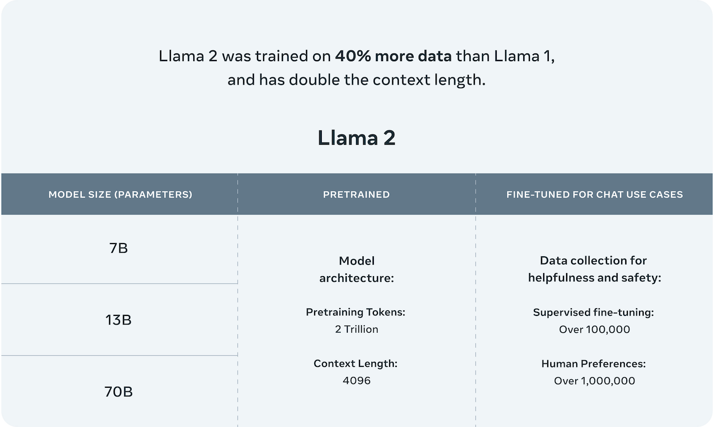
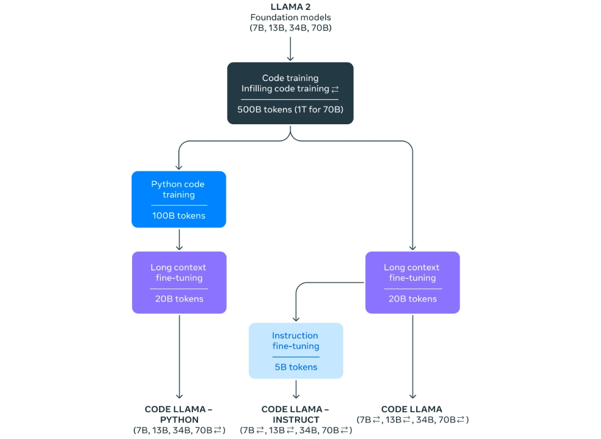

目录

- [Llama 模型简介](#llama-模型简介)
- [Llama 模型发展](#llama-模型发展)
    - [Llama-1 系列](#llama-1-系列)
    - [Llama-2 系列](#llama-2-系列)
    - [Llama-3 系列](#llama-3-系列)
- [Llama 模型架构](#llama-模型架构)
    - [Llama-1 系列](#llama-1-系列-1)
    - [Llama-2 系列](#llama-2-系列-1)
    - [Llama-3 系列](#llama-3-系列-1)
- [参考](#参考)

# Llama 模型简介

Llama 系列大语言模型 是 Meta 开发的，最新的模型是 Llama-3，
作为继 Llama-1、Llama-2 和 Code-Llama 之后的第三代模型，
Llama-3 在多个基准测试中实现了全面领先，性能优于业界同类最先进的模型。
纵观 Llama 系列模型，从版本 1 到 3，
展示了大规模预训练语言模型的演进及其在实际应用中的显著潜力。
这些模型不仅在技术上不断刷新记录，更在商业和学术界产生了深远的影响。

# Llama 模型发展

## Llama-1 系列

Llama-1 是Meta在2023年2月发布的大语言模型，是当时性能非常出色的开源模型之一，
有 7B、13B、30B 和 65B 四个参数量版本。
Llama-1 各个参数量版本都在超过 1T(Trillion, `$10^{16}$`，万亿) token 的语料上进行了预训训练，
其中，最大的 65B 参数的模型在 2,048 张 A100 80G GPU 上训练了近 21 天，
并在大多数基准测试中超越了具有 175B 参数的 GPT-3。

由于模型开源且性能优异，Llama 迅速成为了开源社区中最受欢迎的大模型之一，
以 Llama 为核心的生态圈也由此崛起。与此同时，众多研究者将其作为基座模型，
进行了继续预训练或者微调，衍生出了众多变体模型（见下图），极大地推动了大模型领域的研究进展。
唯一的美中不足的是，因为开源协议问题，Llama-1不可免费商用。

## Llama-2 系列

时隔 5 个月，Meta 在 2023 年 7 月发布了免费可商用版本 Llama-2，有 7B、13B、34B 和 70B 四个参数量版本，
除了 34B 模型外，其他均已开源。相比于 Llama-1，Llama-2 将预训练的语料扩充到了 2T token，
同时将模型的上下文长度从 2,048 翻倍到了 4,096，并引入了 Multi-Query Attention（MQA）等技术。

有了更强大的基座模型 Llama-2，Meta 通过进一步的有监督微调（Supervised Fine-Tuning, SFT）、
基于人类反馈的强化学习（Reinforcement Learning with Human Feedback, RLHF）等技术对模型进行迭代优化，
并发布了面向对话应用的微调系列模型 Llama-2 Chat。通过 “预训练-有监督微调-基于人类反馈的强化学习” 这一训练流程，
Llama-2 Chat 不仅在众多基准测试中取得了更好的模型性能，同时在应用中也更加安全。

随后，得益于 Llama-2 的优异性能，Meta 在 2023 年 8 月发布了专注于代码生成的 Code-Llama，
共有 7B、13B、34B 和 70B 四个参数量版本。

## Llama-3 系列

2024 年 4 月，Meta 正式发布了开源大模型 Llama-3，包括 8B 和 70B 两个参数量版本。
除此之外，Meta 还透露，400B 的 Llama-3 还在训练中。

相比 Llama-2，Llama-3 支持 8K 长文本，并采用了一个编码效率更高的 tokenizer，
词表大小为 128K。在预训练数据方面，Llama-3 使用了超过 15T token 的语料，这比 Llama 2 的 7 倍还多。

Llama-3 在性能上取得了巨大飞跃，并在相同规模的大模型中取得了最优异的性能。
另外，推理、代码生成和指令跟随等能力得到了极大的改进，使 Llama-3 更加可控。

# Llama 模型架构

本节将详细描述 Llama 的模型架构，包括神经网络的大小、层数、注意力机制等。

目前，主流的大语言模型都采用了 Transformer 架构，它是一个基于多层自注意力(Self-attention)的神经网络模型。
原始的 Transformer 由编码器(Encoder)和解码器(Decoder)两个部分构成，同时，这两个部分也可以独立使用。
例如基于编码器的 BERT 模型和基于解码器的 GPT 模型。

Llama 模型与 GPT 类似，也是采用了**基于解码器的架构**。在原始 Transformer 解码器的基础上，
Llama 进行了如下改动：

* 为了增强**训练稳定性**，采用 **前置的 RMSNorm** 作为层归一化方法
* 为了提高**模型性能**，采用 **SwiGLU** 作为激活函数
* 为了更好地**建模长序列数据**，采用 **RoPE** 作为位置编码
* 为了平衡**效率和性能**，部分模型采用了 **分组查询注意力机制(Grouped-Query Attention, GQA)**

具体来说，首先将输入的 **token 序列** 通过 **词嵌入(word embedding)矩阵** 转化为 **词向量序列**。
然后，词向量序列作为隐藏层状态依次通过 `$L$` 个解码器层，并在最后使用 RMSNorm 进行归一化。
归一化后的隐藏层状态将作为最后的**输出**。

在每个解码器层中，输入的隐藏层状态首先通过 RMSNorm 归一化然后被送入注意力模块。
注意力模块的输出将和归一化前的隐藏层状态进行残差连接。之后，新的隐藏层状态进行 RMSNorm 归一化，
然后被送入前馈网络层。类似地，前馈网络层的输出同样进行残差连接，作为解码器层的输出。

每个版本的 Llama 由于其隐藏层的大小、层数的不同，均有不同的变体。接下来，我们将展开看下每个版本的不同变体。

## Llama-1 系列

Llama-1 模型架构：

为了更好地编码数据，Llama-1 使用 BPE(Sennrich R, Haddow B, Birch A.)算法进行分词，
具体由 sentencepiece 进行实现。值得注意的是，Llama-1 将所有数字分解为单独的数字，
并对未知的 UTF-8 字符回退到字节进行分解。词表大小为 32k。

## Llama-2 系列

Llama-2 模型架构：

Llama-2 使用了和 Llama-1 相同的模型架构以及 tokenizer。与 Llama-1 不同的是，
Llama-2 将上下文长长度扩展到了 4k。

## Llama-3 系列

Llama-3 模型架构：

与 Llama-2 相比，Llama-3 将 tokenizer 由 sentencepiece 换成了 tiktoken，这与 GPT4 保持一致。
同时，词表大小由 32k 扩展到了 128k。另外，为了提高模型效率，Llama-3 8B 和 70B 都采用了 GQA。
同时上下文长度也扩展到了 8k。

# 参考

* [欢迎 Llama 3：Meta 的新一代开源大语言模型](https://mp.weixin.qq.com/s?__biz=Mzk0MDQyNTY4Mw==&mid=2247491258&idx=1&sn=722d893beca9bffcfb8063fc12368dcb&chksm=c3f310283b24b4b0d0b1221b23f41c7813f548fbba1a7263adc95ab20057c523ed38d4970a09&scene=132&exptype=timeline_recommend_article_extendread_samebiz&show_related_article=1&subscene=0&scene=132#wechat_redirect)
* [从Llama-1到Llama-3](https://mp.weixin.qq.com/s/5_VnzP3JmOB0D5geV5HRFg)
* [Llama开源家族：从Llama-1到Llama-3](https://github.com/datawhalechina/so-large-lm/blob/main/docs/content/ch14.md)
* [Touvron H, Lavril T, Izacard G, et al. Llama: Open and efficient foundation language models[J]. arXiv preprint arXiv:2302.13971, 2023.]()
* [Touvron H, Martin L, Stone K, et al. Llama 2: Open foundation and fine-tuned chat models[J]. arXiv preprint arXiv:2307.09288, 2023.]()
* [Sennrich R, Haddow B, Birch A. Neural machine translation of rare words with subword units[J]. arXiv preprint arXiv:1508.07909, 2015.]()