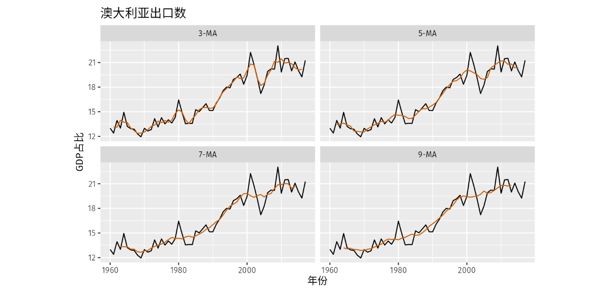
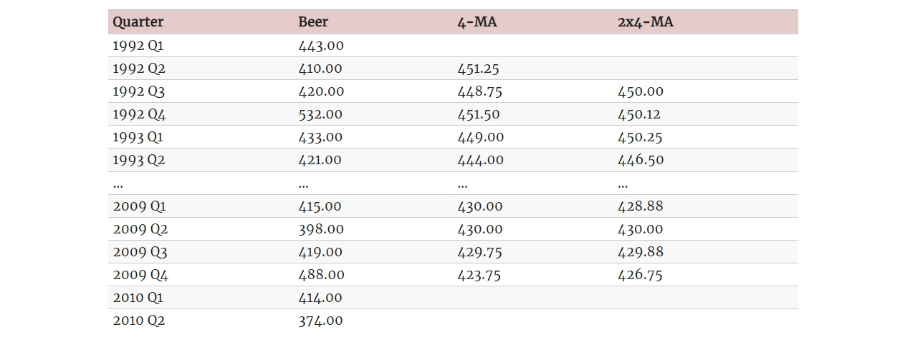

目录

- [变换和调整](#变换和调整)
  - [日历调整](#日历调整)
  - [人口调整](#人口调整)
  - [通货膨胀调整](#通货膨胀调整)
  - [数学变换](#数学变换)
    - [对数变换](#对数变换)
    - [幂变换](#幂变换)
    - [Box-Cox 变换族](#box-cox-变换族)
- [时间列成分](#时间列成分)
  - [加法分解](#加法分解)
  - [乘法分解](#乘法分解)
  - [季节调整数据](#季节调整数据)
- [移动平均](#移动平均)
  - [平滑移动平均](#平滑移动平均)
  - [移动移动平均](#移动移动平均)
  - [用季节数据估计趋势-周期项](#用季节数据估计趋势-周期项)
  - [加权移动平均](#加权移动平均)
- [经典时间序列分解](#经典时间序列分解)
  - [加法分解](#加法分解-1)
  - [乘法分解](#乘法分解-1)
  - [经典时间序列分解法评价](#经典时间序列分解法评价)
- [官方统计机构使用的分解法](#官方统计机构使用的分解法)
  - [X11 分解法](#x11-分解法)
  - [SEATS 分解法](#seats-分解法)
- [STL 分解法](#stl-分解法)

时间序列数据通常有很多种潜在模式，因此一种有效的处理时间序列的方式是将其分解为多个成分，
其中每个成分都对应一种基础模式。

一般有三种基础的时间序列模式：趋势性、季节性和周期性。当我们想要把时间序列分解为多个成分时，
我们通常将趋势和周期组合为趋势-周期项（有时也简单称其为趋势项），因此，我们认为时间序列包括三个成分：趋势-周期项，季节项 和 残差项（残差项包含时间序列中其它所有信息）。
对于不同的季节时期，某些时间序列（例如，至少每日都观测的序列）可能有不止一个季节成份。
我们主要介绍从时间序列中提取成分的常用方法，进而更好的理解时间序列的特点，
并以此提高时间序列的预测精度。

# 变换和调整

分解时间序列时，首先要使变换或调整序列以使分解尽可能简单（随后的分析也要尽可能简单）。
因此，我们从变换和调整开始讨论。

调整历史数据通常可以产生更简单的时间序列。这里，
我们进行四种调整：日历调整、人口调整、通货膨胀调整和数学变换。
这些调整和变换的目的是通过消除来源已知的波动、
或者使整个数据集的特征更加一致，达到简化历史数据特征的目的。

> 更简单的特征通常更容易建模，产生的预测也更准确。

## 日历调整

季节性数据中出现的一些变化可能是由于简单的日历影响。在这种情况下，在进行进一步分析之前，消除这些变化通常更为容易。

例如，如果你正在研究零售店的月度总销售额，除了一年中的季节性波动外，
由于每个月的交易天数不同，
月度销售额也会有变化。通过计算每个月每个交易日的平均销售额，而不是当月的总销售额，
很容易消除由于每月天数不同引起的变化。通过这种方法我们有效地消除了日历变化。

## 人口调整

任何受人口变化影响的数据都可以调整为人均数据。
即考虑每人平均（或每千人平均，或每百万人平均）的数据，而不是总数。

## 通货膨胀调整

受货币价值影响的数据最好在建模前进行调整。比如，如果要比较前后 20 年的同一房子的价格，
需要通过调整时间序列，将房价调整到同一时期的价格表示。一般通过价格指数进行调整，
一个常见的价格指数就是消费者价格指数（CPI）。

## 数学变换

如果数据显示的变化随着序列的级别增加或减少，那么数学变换可能很有用。

### 对数变换

通常可以使用对数变换。如果我们将原始观测值表示为 `$y_{1}，\cdots，y_{T}$`，
并且将变换后的观测值表示为由 `$w_{1}，\cdots，w_{T}$`，则：

`$$w_{T}=log(y_{T})$$`

对数很好用，因为它们是可解释的：对数值的变化可以表示为原始刻度的相对（或百分比）变化。
因此，如果使用的对数基数为 10，那么 `$w_{T}$` 在对数标度上增加 1，
对应于在原始标度 `$y_{T}$` 上乘以 10。如果原始序列有零或负值，则不能求对数。

### 幂变换

有时也会使用其他数学变换（尽管它们可解释度较低）。例如，我们可以使用平方根和立方根。
这些被称为幂变换，因为它们可以写成如下形式：

`$$w_{t}=y_{t}^{P}$$`

### Box-Cox 变换族

> 已有的介绍：[数值特征中的 Box-Cox 变换](https://wangzhefeng.com/note/2022/09/13/feature-engine-type-numeric/#box-cox-%E8%BD%AC%E6%8D%A2)

一个有用的变换族 Box-Cox 变换族，包括对数变换和幂变换，
它取决于参数 `$\lambda$`，定义如下：

`$$w_{t}=\begin{cases}
log(y_{t})，& \lambda = 0 \\
\frac{\Big(sign(y_{t})|y_{t}|^{\lambda}-1\Big)}{\lambda}，& \lambda \neq 0
\end{cases}$$`

<!-- 或者：

`$$y = \begin{cases} 
ln(x)，& \lambda = 0 \\
\frac{(x^\lambda-1)}{\lambda}，& \lambda \neq 0
\end{cases}$$` -->

这实际上是一个修改的 Box-Cox 变换，在 Bickel & Doksum(1981) 中讨论过，
当 `$\lambda>0$` 时允许 `$y_{t}$` 是负值。

Box-Cox 变换中的对数总是自然对数（即以 `$e$` 为对数底）。因此：

* 如果 `$\lambda=0$`，则使用自然对数
* 如果 `$\lambda\neq 0$`，将使用幂变换，然后进行一些缩放
* 如果 `$\lambda=1$`，则 `$w_{t}=y_{t}-1$`，因此变换后的数据向下移动，
  但时间序列的形式没有变化
* 对于 `$\lambda$` 的所有其他值，时间序列将改变形状

合理选择 `$\lambda$` 值可以使整个序列的季节变化大小大致相同，这会使预测模型更简单。

# 时间列成分

## 加法分解

假设一条时间序列是由多种成分相加得来的，那么它可以写为如下形式：

`$$y_{t}=S_{t}+T_{t}+R_{t}$$`

其中：

* `$y_{t}$` 是时间序列数据
* `$S_{t}$` 表示季节成分
* `$T_{t}$` 表示趋势-周期项
* `$R_{t}$` 表示残差项

## 乘法分解

此外，时间序列也可以写成相乘的形式：

`$$y_{t} = S_{t} \times T_{t} \times R_{t}$$`

如果季节性波动的幅度或者趋势周期项的波动不随时间序列水平的变化而变化，
那么加法模型是最为合适的。当季节项或趋势周期项的变化与时间序列的水平成比例时，
则乘法模型更为合适。在经济时间序列中，乘法模型较为常用。
使用乘法分解的一种替代方法是：首先对数据进行变换，
直到时间序列随时间的波动趋于稳定，然后再使用加法分解。
显然，采用对数变换的加法模型等价于乘法模型：

`$$y_{t} = S_{t} \times T_{t} \times R_{t}$$`

等价于

`$$log y_{t} = log S_{t} + log T_{t} + log R_{t}$$`

## 季节调整数据

如果将季节项从原始数据中剔除，可以得到经过”季节调整”后的数据。
对于加法分解，季节调整数据的表达式为：
`$y_{t} - S_{t}$`，对于乘法分解，季节调整数据可以表示为：`$y_{t}/S_{t}$`。

如果我们关心的不是季节性的数据波动，那么季节调整后的时间序列就会十分有用。

例如，每月的失业率会受到季节性因素的影响，在学生离校的时期，当月失业率会显著上升，
但这种失业率并不是由于经济衰退而导致的。因此，当研究经济和失业率的关系时，
应该将失业率进行季节调整。大多数研究实业数据的经济分析学者对非季节性变化更感兴趣。
因此，就业数据（和很多其他的经济数据）通常会经过季节调整。

经过季节调整后的时间序列既包含残差项也包含趋势周期项。因此，它们不太”平滑”，
其”下转折”和”上转折”可能会有误导性。如果我们的目的是找到序列的转折点并解释方向的变化，
那么相比于用季节调整后的数据，用趋势-周期项会更合适。

# 移动平均

时间序列分解的经典方法起源于 20 世纪 20 年代，直到 20 世纪 50 年代才被广泛使用。
它仍然是许多时间序列分解方法的基础，因此了解它的原理十分重要。
传统的时间序列分解方法的第一步是用移动平均的方法估计趋势-周期项。

## 平滑移动平均

> 简单移动平均

`$m$` 阶移动平均可以被写为：

`$$\hat{T}_{t} = \frac{1}{m}\sum_{j=-k}^{k}y_{t+j}$$`

上式中 `$m=2k+1$`，也能是说，时间点 `$t$` 的趋势-周期项的估计值是通过求 `$t$` 时刻前后 `$k$` 周期内的平均得到的。
时间临近的情况下，观测值也很可能接近。由此，平均值消除了数据中的一些随机性，
得到较为平滑的趋势-周期，我们称它为 m-MA，
也就是 `$m$` 阶移动平均。

一个示例：

表中的第三列是 5 阶的移动平均，它给出了趋势-周期项的估计值。
这列的第一个值表示前 5 个观测值的平均值（1960-1964）；
第二个值是 1961-1965 的平均值；以此类推。
5-MA 列中的每一个值是以对应年份为中心的 5 年的观测值的平均值。
在上面的方程式中，5-MA 列包含值 `$\hat{T}_{t}$`，其中 `$k=2$`，`$m=2k+1=5$`。
头两年或最后两年都没有数值，因为我们在两端没有观测值。
稍后，我们将使用更复杂的趋势周期估计方法，将允许在端点附近进行估计。 

移动平均的阶数决定了趋势-周期项的平滑程度。
一般情况下，阶数越大曲线越平滑。

简单移动平均的阶数常常是奇数阶（例如：3，5，7等），这样可以确保对称性。
在阶数为 `$m=2k+1$` 的移动平均中，中心观测值和两侧各有的 `$k$` 个观测值可以被平均。
但是如果 `$m$` 是偶数，那么它就不再具备对称性。

## 移动移动平均

> m 阶中心移动平均

可以对移动平均序列计算它的移动平均，这样便可使偶数阶移动平均具备对称性。

一个示例：我们可能求得一个阶数为4的移动平均，然后对所得的结果再求出其2阶移动平均。

最后一列的符号 2×4-MA 的意义是在进行 4-MA 后再进行 2-MA。
最后一列的值是由前一列数据进行 2 阶移动平均后得到的。
例如，4-MA 列中最前面两个值为：`$451.25=(443+410+420+532)/4$` 和 `$448.75=(410+420+532+433)/4$`。
2x4-MA 列的第一个值是这两者的平均：`$450.00=(451.25+448.75)/2$`。

对偶数阶（例如 4 阶）移动平均后的序列进行 2-MA，称其为：“4 阶中心移动平均”。
这是因为这样处理后的结果是对称的。详细来讲，我们可以将 2×4-MA 写为如下形式：

`$$\begin{align*}
  \hat{T}_{t} &= \frac{1}{2}\Big[
    \frac{1}{4} (y_{t-2}+y_{t-1}+y_{t}+y_{t+1}) +
    \frac{1}{4} (y_{t-1}+y_{t}+y_{t+1}+y_{t+2})\Big] \\
             &= \frac{1}{8}y_{t-2}+\frac14y_{t-1} +
             \frac14y_{t}+\frac14y_{t+1}+\frac18y_{t+2}.
\end{align*}$$`

可见它现在是对称观测值的加权平均值。

移动平均的其他组合也是可行的。例如，3×3-MA 也很常用，
它是指进行3阶移动平均后再进行一次 3 阶移动平均。
一般来讲，进行偶数阶的移动平均后应该再进行一个偶数阶移动平均使其对称。
相似地，奇数阶的移动平均后应该再进行一个奇数阶移动平均。

## 用季节数据估计趋势-周期项

中心移动平均法最经常的应用是用于季节数据估计趋势-周期项。

对 2×4-MA：

`$$\hat{T}_{t} = \frac18 y_{t-2} + \frac14 y_{t-1} + \frac14 y_{t} + \frac14 y_{t+1} + \frac18 y_{t+2}$$`

当应用于季度数据的时候，每年的每个季度的权重都相等，因为第一个和最后一个季度在连续的年分中应用于同一个季度。
因此，季节波动将会被抹平，并且所得到的 `$\hat{T}_{t}$` 中会几乎或完全没有季节性波动的存在。
使用 2×8-MA 或是 2×12-MA 会得到类似的效果。

一般情况下，2×m-MA 等同于 m+1 阶加权平均，在这个方法中每个观测值的权重都是 `$1/m$`，
除了第一个值和最后一个值的权重是 `$1/(2m)$`。因此，如果季节周期项是偶数，
并且阶数为 m，我们用 2×m-MA 来估计趋势-周期项。如果季节项是奇数，
阶数是 m，我们用 m-MA 来估计趋势-周期项。例如，2×12-MA 可以用来估计月度趋势-周期项，
7-MA 可以来估计有星期周期变化的日数据趋势-周期项。

MA 的其他阶数通常会导致估计趋势-周期项时被数据中的季节性干扰。

## 加权移动平均

简单移动平均的组合可以生成加权移动平均。

例如上文所探讨的 2×4-MA 等价于加权 5-MA，
其权重为：`$\left[\frac{1}{8},\frac{1}{4},\frac{1}{4},\frac{1}{4},\frac{1}{8}\right]$`。

一般来讲，加权 m-MA 可以写为：

`$$\hat{T}_t = \sum_{j=-k}^k a_j y_{t+j},$$`

在上式中 `$k=(m-1)/2$`，其权重为：`$[a_{-k}, \cdots, a_{k}]$`。
非常重要的一点是所选择的各期权重之和为 1，并且它们是对称的，即 `$a_{j}=a_{-j}$`。
m-MA 中的权重均为 `$1/m$` 是一个简单的特例。

加权移动平均法的一大优势是它可以让趋势周期项的估计更平滑。
观测值不是直接完全进入或离开计算，它们的权重缓步增加，
然后缓步下降，让曲线更加平滑。

# 经典时间序列分解

经典时间序列分解法起源于 20 世纪 20 年代。它的步骤相对简单，
它是很多其他的时间序列分解法的基石。有两种经典时间序列分解法：
加法分解和乘法分解。

下面将描述一个季节周期为 `$m$` 的时间序列（例：`$m=4$` 的季度数据，`$m=12$` 的月度数据， 
`$m=7$` 的周度数据）。

在经典时间序列分解法中，我们假设季节项每年都是连续的。对于乘法季节性，
构成季节项的 `$m$` 个值被称为季节指数。

## 加法分解

* 步骤1：若 `$m$` 为偶数，用 2×m-MA 来计算趋势周期项 `$\hat{T}_{t}$`。
  若 `$m$` 为奇数，用 m-MA 来计算趋势周期项 `$\hat{T}_{t}$`。
* 步骤2：计算去趋势序列：`$y_{t}-\hat{T}_{t}$`。
* 步骤3：为了估计每个季度的季节项，简单平均那个季度的去趋势值。例如，对于月度数据，
  三月份的季节项是对所有去除趋势后的三月份的值的平均。然后将这些季节项进行调整，
  使得它们的加和为 0。季节项是通过将这些各年的数据排列结合在一起而得到的，
  即  `$\hat{S}_{t}$`。
* 步骤 4：残差项是通过时间序列减去估计的季节项和趋势-周期项求得的：`$\hat{R}_{t}=y_{t}-\hat{T}_{t}-\hat{S}_{t}$`。

## 乘法分解

经典乘法分解与加法分解十分相似，只不过是用除法代替了减法。

* 步骤 1：若 `$m$` 为偶数，用 2×m-MA 来计算趋势周期项 `$\hat{T}_{t}$`。
  若 `$m$` 为奇数，用 m-MA 来计算趋势周期项 `$\hat{T}_{t}$`。
* 步骤 2：计算去趋势序列：`$y_{t}-\hat{T}_{t}$`。
* 步骤 3：为了估计每个季度的季节项，简单平均那个季度的去趋势值。
  例如，对于月度数据，三月份的季节项是对所有去除趋势后的三月份的值的平均。
  然后将这些季节项进行调整，使得它们的加和为 `$m$`。
  季节项是通过将这些各年的数据排列结合在一起而得到的，即 `$\hat{S}_{t}$`。
* 步骤 4：残差项是通过时间序列除以估计的季节项和趋势-周期项求得的：`$\hat{R}_{t}=y_{t}/(\hat{T}_{t}\hat{S}_{t})$`。

## 经典时间序列分解法评价

尽管经典时间序列分解法的应用还很广泛，但是我们不十分推荐使用它，因为现在已经有了一些更好的方法。
经典时间序列分解的几点问题总结如下：

1. 经典时间序列分解法无法估计趋势-周期项的最前面几个和最后面几个的观测。例如，若 `$m=12$`，
   则没有前六个或后六个观测的趋势-周期项估计。由此也会使得相对应的时期没有残差项的估计值。
2. 经典时间序列分解法对趋势-周期项的估计倾向于过度平滑数据中的快速上升或快速下降（如上面例子中所示）。
3. 经典时间序列分解法假设季节项每年是重复的。对于很多序列来说这是合理的，但是对于更长的时间序列来说这还有待考量。
   例如，因为空调的普及，用电需求模式会随着时间的变化而变化。具体来说，在很多地方几十年前的时候，
   各个季节中冬季是用电高峰（用于供暖加热），但是现在夏季的用电需求最大（由于开空调）。
   经典时间序列分解法无法捕捉这类的季节项随时间变化而变化。
4. 有时候，时间序列中一些时期的值可能异乎寻常地与众不同。例如，每月的航空客运量可能会受到工业纠纷的影响，
   使得纠纷时期的客运量与往常十分不同。处理这类异常值，经典时间序列分解法通常不够稳健。

# 官方统计机构使用的分解法

官方统计机构负责大量的官方经济和社会时间序列。这些机构制定了自己的用于季节性调整的分解程序。
他们大多使用 X-11 方法的变体或 SEATS 方法，或者两者组合使用。这些方法专门用于处理季度和月度数据，
这也是官方统计机构处理的最常见的序列数据。他们不会处理其他类型的季节性数据，如每日数据、每小时数据或每周数据。
我们将使用这组被称为 "X-13ARIMA-SATS" 的方法的最新实现。

## X11 分解法

用于分解季度月度数据的另一个流行方法是X11分解法，它最初起源于美国人口普查局和加拿大统计局。

这个方法是基于经典时间序列分解法的，但是它包括了很多用于克服经典时间序列分解法的缺陷的额外步骤与特征。
具体来讲，它可以估计包括端点在内的各个时期的趋势-周期项，并且它允许季节项缓慢变化。
X11 还有一些复杂的方法来处理交易日的变化，假日效应和已知的预测因素的影响。
它既可以处理加法分解也可以处理乘法分解。它的过程是全自动的，并且它对序列中的离群值和水平移动较为严苛。

## SEATS 分解法

“SEATS”表示”ARIMA时间序列的季节提取 （Seasonal Extraction in ARIMA Time Series）”。
这个方法是西班牙银行发明的，现在被世界各地的政府机构广泛使用。

# STL 分解法

STL(Seasonal and Trend decomposition using Loess) 是一个非常通用和稳健的分解时间序列的方法，
其中 Loess 是一种估算非线性关系的方法。

相比于经典、SEATS 和 X-11 分解法 STL 分解法有几点优势：

* 与 SEATS 和 X-11 不同的是，STL 可以处理任何类型的季节性，不仅仅是月度数据和季度数据。
* 季节项可以随时间变化而变换，并且变化的速率可以由用户掌控。
* 趋势-周期项的平滑程度也可以由用户掌控。
* 可以不受离群点干扰（例如，用户可以指定一个稳健的分解）

另一方面，STL 也有一些不足之处。具体来讲，它不能自动地处理交易日或是其他有变动的日子，
并且它提供了处理加法分解的方式。

为了得到乘法分解我们可以首先对数据取对数，然后对各成分进行反向变换。
对数据进行 `$0 < \lambda < 1$` 的 Box-Cox 变换可以得到加法分解与乘法分解。
其中 `$\lambda = 0$` 的值对应于乘法分解，`$\lambda = 1$` 等价于加法分解。

使用 STL 时要选择的两个主要参数是 趋势-周期窗口 和 季节窗口。
这些参数控制了趋势-周期项和季节项的变化速度，它们的值越小允许变化的速度越快。
两个窗口都需要是奇数。趋势窗口是在估计趋势周期时要使用的连续观测的数量；
季节窗口是用于估计季节成分中每个值的连续年份数。
将季节窗口设为无穷相当于强制季节成分是周期性的（即各年相同）。

