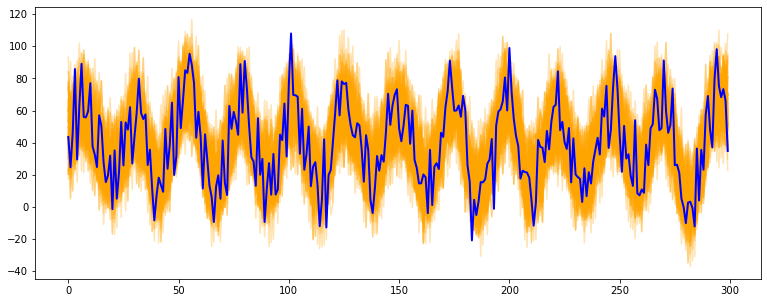

<style>
details {
    border: 1px solid #aaa;
    border-radius: 4px;
    padding: .5em .5em 0;
}
summary {
    font-weight: bold;
    margin: -.5em -.5em 0;
    padding: .5em;
}
details[open] {
    padding: .5em;
}
details[open] summary {
    border-bottom: 1px solid #aaa;
    margin-bottom: .5em;
}
img {
    pointer-events: none;
}
</style>

<details><summary>目录</summary><p>

- [tsmoothie 平滑](#tsmoothie-平滑)
    - [平滑技术](#平滑技术)
        - [指数平滑](#指数平滑)
        - [LOWESS](#lowess)
    - [区间计算](#区间计算)
    - [Bootstrap 算法](#bootstrap-算法)
- [tsmoothie 安装](#tsmoothie-安装)
- [tsmoothie 使用](#tsmoothie-使用)
    - [tsmoothie 平滑 demo](#tsmoothie-平滑-demo)
        - [随机游走数据平滑](#随机游走数据平滑)
        - [季节性数据平滑](#季节性数据平滑)
    - [tsmoothie Bootstrap demo](#tsmoothie-bootstrap-demo)
    - [时间序列平滑以更好地聚类](#时间序列平滑以更好地聚类)
    - [时间序列平滑以更好地预测](#时间序列平滑以更好地预测)
        - [时间序列数据](#时间序列数据)
        - [时间序列数据平滑](#时间序列数据平滑)
    - [时间序列异常检测](#时间序列异常检测)
    - [极端事件的时间序列预处理](#极端事件的时间序列预处理)
    - [深度学习中的时间序列 Bootstrap](#深度学习中的时间序列-bootstrap)
- [参考](#参考)
</p></details><p></p>

> A python library for time-series smoothing and outlier detection in a vectorized way.
> 
> * 去噪
> * 异常值剔除
> * 保留原始数据中存在的时间模式

# tsmoothie 平滑

## 平滑技术

tsmoothie 使用的平滑技术：

* Exponential Smoothing(指数平滑)
* Convolutional Smoothing(卷积平滑)
    - constant: window types
    - hanning: window types
    - hamming: window types
    - bartlett: window types
    - blackman: window types
* Spectral Smoothing with Fourier Transform(傅里叶变换的频谱平滑)
* Polynomial Smoothing(多项式平滑)
* Spline Smoothing(样条平滑)
    - linear
    - cubic
    - natural
    - cubic
* Gaussian Smoothing(高斯平滑)
* Binner Smoothing(分箱平滑)
* LOWESS(局部加权回归散点平滑法)
* Seasonal Decompose Smoothing(季节性分解)
    - convolution 
    - lowess 
    - natural 
    - cubic 
    - spline
* Kalman Smoothing(卡尔曼平滑) with customizable components
    - level
    - trend
    - seasonality
    - long seasonality

### 指数平滑


### LOWESS

二维变量之间的关系研究是很多统计方法的基础，例如回归分析通常会从一元回归讲起，然后再扩展到多元情况。
局部加权回归散点平滑法（locally weighted scatterplot smoothing，LOWESS 或 LOESS）是查看二维变量之间关系的一种有力工具。

LOWESS 主要思想是取一定比例的局部数据，在这部分子集中拟合多项式回归曲线，
这样便可以观察到数据在局部展现出来的规律和趋势；
而通常的回归分析往往是根据全体数据建模，这样可以描述整体趋势，
但现实生活中规律不总是（或者很少是）教科书上告诉的一条直线。
将局部范围从左往右依次推进，最终一条连续的曲线就被计算出来了。
显然，曲线的平滑程度与选取数据比例有关：比例越少，
拟合越不平滑（因为过于看重局部性质），反之越平滑


## 区间计算

tsmoothie 提供了作为平滑过程结果的区间计算，这对于识别时间序列中的异常值非常有用。
区间类型有：

* sigma interval
* confidence interval
* predictions interval
* kalman interval

tsmoothie 可以进行滑动平滑的方法来模拟在线使用。
这可以将时间序列分成大小相等的部分并独立平滑它们。
与往常一样，此功能通过 `WindowWrapper` 类以矢量化方式实现

## Bootstrap 算法

tsmoothie 可以通过 `BootstrappingWrapper` 类操作时序引导，用到的 Bootstrap 算法有：

* none overlapping block bootstrap
* moving block bootstrap
* circular block bootstrap
* stationary bootstrap

# tsmoothie 安装

```bash
$ pip install tsmoothie
```

# tsmoothie 使用

## tsmoothie 平滑 demo

### 随机游走数据平滑

```python
import numpy as np
import matplotlib.pyplot as plt
from tsmoothie.utils_func import sim_randomwalk
from tsmoothie.smoother import LowessSmoother

# ------------------------------
# generate 3 randomwalks of length 200 
# ------------------------------
np.random.seed(123)
data = sim_randomwalk(
    n_series = 3,
    timesteps = 200,
    process_noise = 10,
    measure_noise = 30,
)

# ------------------------------
# Smoothing
# ------------------------------
# operate smoothing
smoother = LowessSmoother(smooth_fraction = 0.1, iterations = 1)
smoother.smooth(data)
# generate intervals
low, up = smoother.get_intervals("prediction_interval")

# ------------------------------
# plot the smoothed timeseries with intervals 
# ------------------------------
plt.figure(figsize = (18, 5))
for i in range(3):
    plt.subplot(1, 3, i + 1)
    plt.plot(smoother.smooth_data[i], linewidth = 3, color = "blue")
    plt.plot(smoother.data[i], ".k")
    plt.title(f"timeseries {i + 1}")
    plt.xlabel("time")
    plt.fill_between(
        range(len(smoother.data[i])),
        low[i],
        up[i],
        alpha = 0.3,
    )
```


### 季节性数据平滑

```python
# import libraries
import numpy as np
import matplotlib.pyplot as plt
from tsmoothie.utils_func import sim_seasonal_data
from tsmoothie.smoother import DecomposeSmoother

# ------------------------------
# generate 3 periodic timeseries of lenght 300
# ------------------------------
np.random.seed(123)
data = sim_seasonal_data(
    n_series = 3, 
    timesteps = 300, 
    freq = 24, 
    measure_noise = 30
)

# ------------------------------
# Smoothing
# ------------------------------
# operate smoothing
smoother = DecomposeSmoother(
    smooth_type = 'lowess', 
    periods = 24,
    smooth_fraction = 0.3
)
smoother.smooth(data)
# generate intervals
low, up = smoother.get_intervals('sigma_interval')

# ------------------------------
# plot the smoothed timeseries with intervals 
# ------------------------------
plt.figure(figsize = (18, 5))
for i in range(3):
    plt.subplot(1, 3, i + 1)
    plt.plot(smoother.smooth_data[i], linewidth = 3, color = 'blue')
    plt.plot(smoother.data[i], '.k')
    plt.title(f"timeseries {i+1}")
    plt.xlabel('time')
    plt.fill_between(
        range(len(smoother.data[i])), 
        low[i], 
        up[i], 
        alpha = 0.3
    )
```


## tsmoothie Bootstrap demo

```python
# import libraries
import numpy as np
import matplotlib.pyplot as plt
from tsmoothie.utils_func import sim_seasonal_data
from tsmoothie.smoother import ConvolutionSmoother
from tsmoothie.bootstrap import BootstrappingWrapper

# ------------------------------
# generate a periodic timeseries of lenght 300 
# ------------------------------
np.random.seed(123)
data = sim_seasonal_data(
    n_series = 1, 
    timesteps = 300, 
    freq = 24, 
    measure_noise = 15
)

# ------------------------------
# operate bootstrap 
# ------------------------------
bts = BootstrappingWrapper(
    ConvolutionSmoother(
        window_len = 8, 
        window_type = 'ones'
    ), 
    bootstrap_type = 'mbb', 
    block_length = 24
)
bts_samples = bts.sample(data, n_samples = 100)

# ------------------------------
# plot the bootstrapped timeseries
# ------------------------------
plt.figure(figsize = (13, 5))
plt.plot(bts_samples.T, alpha = 0.3, c = 'orange')
plt.plot(data[0], c = 'blue', linewidth = 2)
```



## 时间序列平滑以更好地聚类


## 时间序列平滑以更好地预测

降低传感器中的噪声以更好地预测太阳能电池板的发电量

### 时间序列数据

* 房子每天的煤气消耗量，`$m^{3}$`
* 房子每天的用电量，`$kWh$`
    - 负值表示太阳能超出了房子的用电量 
* 直流转交流转换器上功率计的日值。这是当前累积的太阳能发电量。
  不需要累积值，而是需要绝对的每日值，因此，进行简单的微分操作。
  这是预测的目标

### 时间序列数据平滑

Kalman Filter

## 时间序列异常检测


## 极端事件的时间序列预处理


## 深度学习中的时间序列 Bootstrap


# 参考

* [GitHub tsmoothie](https://github.com/cerlymarco/tsmoothie)
* [用局部加权回归散点平滑法观察二维变量之间的关系](https://cosx.org/2008/11/lowess-to-explore-bivariate-correlation-by-yihui/)
* [Time Series Smoothing for better Forecasting](https://towardsdatascience.com/time-series-smoothing-for-better-forecasting-7fbf10428b2)
